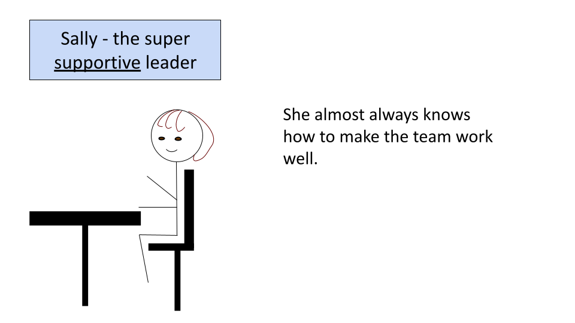
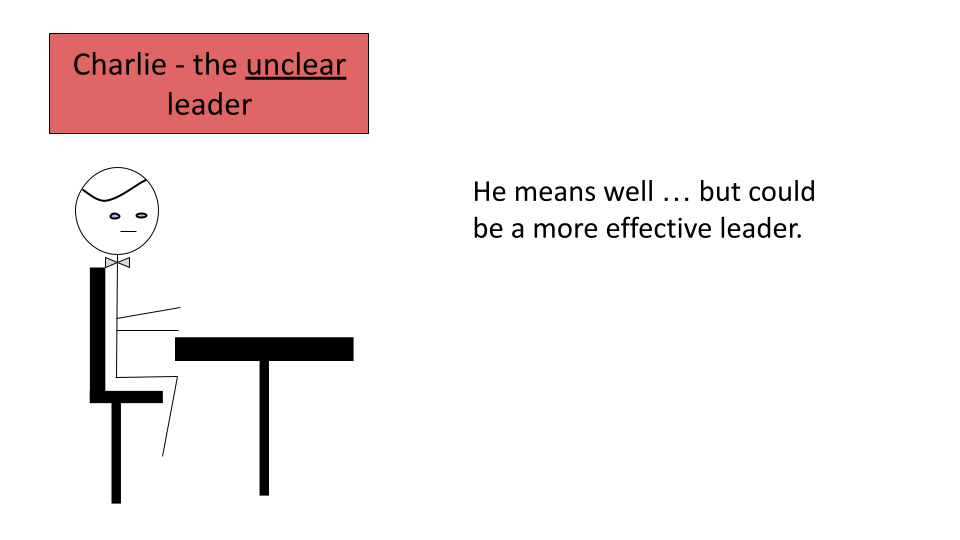
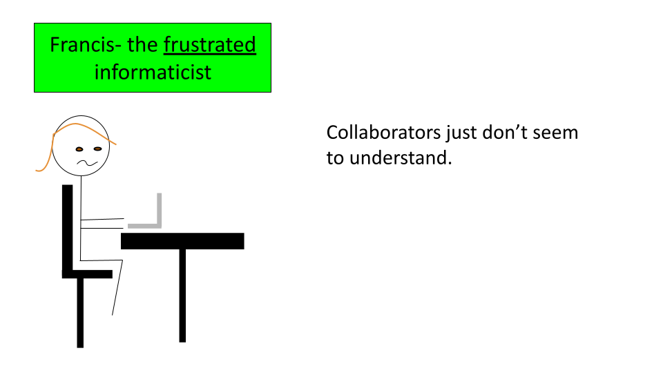

# Introduction 

## Motivation

Informatics research often requires multidisciplinary teams. This requires more flexibility to communicate with team members with distinct backgrounds. Furthermore, team members often have different research and career goals. This can present unique challenges in making sure that everyone is on the same page and cohesively working together. This course aims to provide research leaders with guidance about:  

 1) How to effectively lead team members on informatics projects  
 2) How to perform informatics projects well   

We will provide you with an awareness for the **specific challenges** that your informatics collaborators, employees, and mentees might face, as well as ways to mitigate these challenges. By creating a better work environment for your informatics research team, you will ultimately improve the potential impact of your work. 

We will also discuss the major pitfalls of informatics research and discuss best practices for performing informatics research correctly and well, so that you can get the most out of your informatics projects. 

**Target Audience:**  
The course is intended for researchers who may lead who have moderate to no computational experience and who may lead or collaborate with informatics experts.

**Curriculum:**  
This course will feature 
The curriculum will also cover 

## Meet the team!

In order to familiarize you with guidelines for how to make the most out of your informatics projects we are going to introduce you to some characters of the type of people you may encounter on your journey. 

First our fearless lab leaders who lead informatics research projects. We have Sally who is experienced with working with team members from many disciplines including informatics experts. She helps guide her lab through successful projects all the time.

{type: video, poster: "http://img.youtube.com/vi/VOCYL-FNbr0/mqdefault.jpg", embed: true, align: middle}

{alt: "Sally", align: middle}

Next, we have Charlie. He is new to informatics research and could learn a bit about how to work with informatics experts more effectively.

{alt: "Sally", fullbleed: true, height = "100%", width = "100%"}

Now we have our informaticists. First is Jack, who is often forgotten by his lab leader.

We also have Hilda, an example of a happy informaticist. She feels supported in all the ways that she needs, allowing her to be as productive and helpful as possible.

Here is Francis the frustrated collaborator.

Finally we have Harry, the helpful collaborator.

We will now describe some guidelines for how to be an effective leader, collaborator and mentor on informatics projects so that you can be more like Sally with mentees and employees like Hilda and collaborators like Harry.

