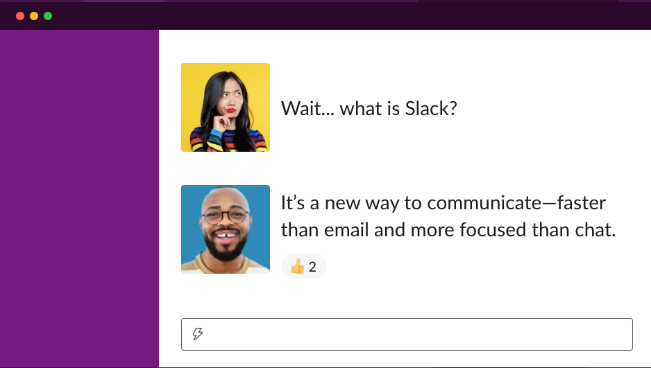
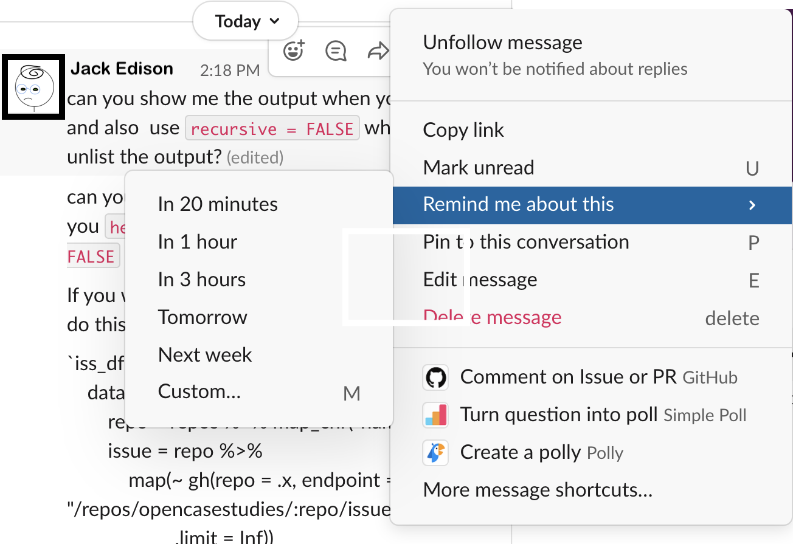

# Informatics lab management tools

There are a few tools that can be especially useful for assisting with day-to-day management of projects involving informatics regardless of if you are simply collaborating with an informatics expert or you are leading an informatics research team.

## Slack


[Slack](https://slack.com/) is a communication tool that allows you to communicate with lab members much more efficiently than email. It is a bit like a combination of an instant message system, email, and dropbox. 


avocado add to slides


[[source](https://slack.com/)]

```{r, fig.alt="Wait, what is Slack? It's a new way to communicate -faster than email and more focused than chat", out.width = "100%", echo = FALSE}
leanbuild::include_slide("https://docs.google.com/presentation/d/1OU5qeRgN_fojGbcyu2qEdwlcKpDO6BveWtYW_u1Hqd4/edit#slide=id.gd37aae88fc_0_0")
```


avocado update
<iframe width="560" height="315" src="https://www.youtube-nocookie.com/embed/EYqxQGmQkVw" frameborder="0" allow="accelerometer; autoplay; clipboard-write; encrypted-media; gyroscope; picture-in-picture" allowfullscreen></iframe>

You can do quite well with the free version of slack. It may be all that your research group needs indefinitely. The major difference between the free version and the paid versions is that the free version does not save all of your message history. 

Currently, with the free version you can search through the history of the last 10,000 messages. From our experience using this with a department with about 250 users, it takes about a year to reach this threshold. If you choose to go with the free option and share any really important messages or files, make sure to save them just in case.

## How to use slack?

### Workspaces

The main landing page for slack is called a workspace, which looks like this:

avocado add to slides - is the alt text ok?


```{r, fig.alt="An image of a slack profile landing page whcih shows workspaces on the far left, then channels, then messages for a specific channel.", out.width = "100%", echo = FALSE}
leanbuild::include_slide("https://docs.google.com/presentation/d/1OU5qeRgN_fojGbcyu2qEdwlcKpDO6BveWtYW_u1Hqd4/edit#slide=id.gd37aae88fc_0_0")
```

In the above image, this person has five workspaces which are indicated by the squares on the far left. Each workspace allows for multiple channels for communicating. These channels can include all members of the workspace or specific subsets of members. Team members can also have separate direct messages to have one-on-one discussions.

It's a good idea to check if your department or institute is already using slack. If so, they may have a workspace that you can join. Otherwise you may want to think about recruiting your department or institute to start using slack. In this case you could start a workspace where people outside your research group can communicate. This would still allow you to have group messages with your lab or specific groups within the lab. Otherwise, you can start a workspace just for your research group. 

### Channels

Channels are the main way in which you can converse with your team on slack.

We recommend making a slack channel for your entire research group. Everyone in your group will be able to discuss something by sending messages in real time. If someone is not available at that time, they will see the message when they next check slack. 
We also recommend making project specific channels. For these channels you can add all of the team members working on a specific project, so that they can easily discuss and review discussions about the project. 

Importantly, you can make channels private or public. If a channel is public, anyone in the workspace can join.

avocado add to slides


```{r, fig.alt="Create a channel: Channels are where your team communicates. They're best when organized around a topic - #marketing, for example. Provide a name and optionally a description. You can also decide to make a channel private, it can only be viewed or joined by inivitation.", out.width = "100%", echo = FALSE}
leanbuild::include_slide("https://docs.google.com/presentation/d/1OU5qeRgN_fojGbcyu2qEdwlcKpDO6BveWtYW_u1Hqd4/edit#slide=id.gd37aae88fc_0_0")
```

## Features

### Pins

If someone sends a really important message, like a link to a relevant document, you can "pin" the message so that it is easier to find later. 

Hovering over a message you will get the following options:


avocado add to slides

```{r, fig.alt="An image of the options for a slack message", out.width = "100%", echo = FALSE}
leanbuild::include_slide("https://docs.google.com/presentation/d/1OU5qeRgN_fojGbcyu2qEdwlcKpDO6BveWtYW_u1Hqd4/edit#slide=id.gd37aae88fc_0_0")
```

Clicking on the 3 dot button allows you to do several useful things for a message including pinning it to find it easily later.

avocado add to slides

```{r, fig.alt="This image shows the option to pin a message in a channel.", out.width = "100%", echo = FALSE}
leanbuild::include_slide("https://docs.google.com/presentation/d/1OU5qeRgN_fojGbcyu2qEdwlcKpDO6BveWtYW_u1Hqd4/edit#slide=id.gd37aae88fc_0_0")
```

### Code
One great feature about slack, is that it is very convenient to message about code.


avocado add to slides


```{r, fig.alt="An example of a slack message with code which is displayed differently as it is in red font witha gray background", out.width = "100%", echo = FALSE}
leanbuild::include_slide("https://docs.google.com/presentation/d/1OU5qeRgN_fojGbcyu2qEdwlcKpDO6BveWtYW_u1Hqd4/edit#slide=id.gd37aae88fc_0_0")
```


You can also attach files directly to messages just like in the above message which has a screen shot image file.

### Reminders

If you want to be reminded about a message in 20 minutes or next week you can also do that using the same hovering and 3 dot button option.

avocado add to slides

Thus if Jack gets a message from his advisor Charlie, but he is busy doing deep work on something else, he can ask Slack to remind him later.

```{r, fig.alt="An image of the options for a slack message"}
leanbuild::include_slide("https://docs.google.com/presentation/d/1OU5qeRgN_fojGbcyu2qEdwlcKpDO6BveWtYW_u1Hqd4/edit#slide=id.gd37aae88fc_0_0")
```


avocado add to slides


```{r, fig.alt="An image of right clicking on a slack message to allow setting a reminder of the message for either in 20 minutes, 1 hour, 3 hours, tomorrow, next week or custom.", out.width = "100%", echo = FALSE}
leanbuild::include_slide("https://docs.google.com/presentation/d/1OU5qeRgN_fojGbcyu2qEdwlcKpDO6BveWtYW_u1Hqd4/edit#slide=id.gd37aae88fc_0_0")
```

You may also notice in the image above that your messages can be **edited!** unlike an email, in addition yoou can mark them as unread, which can also be useful for responding to messages asynchronously.


### Polls

One other nice feature for working with a team is that you can directly poll your team.
 
 
Say sally wants to schedule a meeting with the lab teammates for a specific project- this could even include collaborators who are outside of the lab. If all the users are on the same Slack channel, she can send out a poll like this one asking people to resond with times that they are available. 

avocado add to slides

```{r, fig.alt=" An example of a slack simple poll that says: When can you meet about the cell line project?- Monday at noon, Tuesday at noon, Wednesday at 2, or None of these options work.", out.width = "100%", echo = FALSE}
leanbuild::include_slide("https://docs.google.com/presentation/d/1OU5qeRgN_fojGbcyu2qEdwlcKpDO6BveWtYW_u1Hqd4/edit#slide=id.gd37aae88fc_0_0")
```

## Git and GitHub

You can learn more about these tools in the Data Management course, however we will give a brief introduction now.

Informatics work can especially benefit from keeping track of your steps and the code that you have used. In some cases your lab may use a tool like [Galaxy](https://usegalaxy.org/) which has built in options for keeping track of the steps that your lab members are taking during their research. However, other tools do not have this option. Instead, we can use a tool called [Git](https://git-scm.com/) which allows for something called ["version control"](https://git-scm.com/book/en/v2/Getting-Started-About-Version-Control).

[Version control](https://en.wikipedia.org/wiki/Version_control) is the tracking of changes to a file or files overtime. This is equivalent to saving different versions of a grant proposal overtime. However, as you may have noticed, this is not an easy process to maintain. Tools like Git (Git is one of the most popular) help us to keep track of changes. If we save our changes often, we can easily modify our files back to a recent version if necessary. This may be less useful for a grant proposal (although we would argue that it really can be!), but it can be absolutely critical for your informatics code. 

Why is this?

Small changes in your code may result in your code breaking or generating completely different results. To make matters worse, sometimes your scripts may be lengthy, if you have 4,000 lines of code, it can be difficult to identify what is different between one version and another. Git really helps with this. 

AVOCADO add cartoon about charlie accidentally deleating a script locally- but its ok cause it is on Git! or something like that - could be Jack on his own or a cartoon of harry and sally sharing files and code...


So what is [GitHub](https://en.wikipedia.org/wiki/GitHub)?


[GitHub](https://github.com/) is a free hosting site for code (or other files - including those grant proposals!). Therefore, all the different versions of your files can be saved and accessed online at GitHub. You can make these files private or public. 

According to Wikipedia:

> As of January 2020, GitHub reports having over 40 million users and more than 190 million repositories (including at least 28 million public repositories), making it the largest host of source code in the world.

You do not have to use GitHub to use Git. If you have data that needs to be complaint with HIPPA, you could still use Git on a local server (more on this in other courses). Alternatively, you could use GitHub after you de-identify your data. 

AVOCADO more on using github with sensitive data.
See [here](https://github.com/truevault/hipaa-compliance-developers-guide) for info about ways to use GitHub for data that needs to be HIPAA compliant.

HIPPA compliancy group
https://compliancy-group.com/large-scale-hipaa-security-breach-improper-use-of-github/

reproducibility... (several options here...)

GitHub/Git

https://r-bio.github.io/intro-git-rstudio/

https://thenewstack.io/dont-mess-with-the-master-working-with-branches-in-git-and-github/


## Docker

If you are using a pipeline to process data or creating software that depends on other software programs and particularly if you have multiple team members modifying code for the pipeline or the software, or if you ultimately want to share your pipeline or software, it is recommended that you use a method to ensure that you (as well as you in the future!) and your team  and anyone you want to share your pipeline or software with uses the same dependency software and of the same versions! There are a few ways to do this, but one of the simplest is to use what is called Docker. 

You might be familiar with something called a [virtual machine](https://azure.microsoft.com/en-us/overview/what-is-a-virtual-machine/). A virtual machine basically allows you to perform operations on your computer, but as if you are using a different computer! This is handy because you can ensure that you not only have similar software installed but you are also working with the same [operating system](https://edu.gcfglobal.org/en/computerbasics/understanding-operating-systems/1/) as your teammates (even if your computer has a different operating system). Pretty cool, right!?

avocado need to work on this...
Docker is similar to this, except it uses what is called a container. This allows users to work with software that is preinstalled and an environment that is preconfigured, however it uses more of your existing operating system. This is good becuase it means that it takes less time than using a virtual machine.

See [here](https://www.backblaze.com/blog/vm-vs-containers/) to read more about the differences between virtual machines and containers like Docker.

Like GitHub, there is a DockerHub, where people store different docker images.You can download other people's docker images, or you can store your own.

## avocado Figshare etc.
## R Markdown 

If your research teammates are using the R programming language often, we strongly suggest that you consider having these teammates use what is called R markdown to create reports of their analyses. Ideally for the sake of  reproducibility andtransparency, we recommend that your informatics teammates write such reports as they are performing their analyses - not afterwards. 

This makes it easy to have a report that shows a bit of the data (or all the data if your data is very samll), the code, commentary about what the code is doing, as well the actual output of the code for a given informatics process.

We also recommend describing what data you are using, who performed the analysis and when and why, all in one document. This really helps with troubleshooting in the future, as well as simplifying maintaining code over time. It also makes it eaiser to train new lab members or communicate to collaboraters how your code works. 

The really nice thing about these reports is you can export them in a variety of formats like html websites, pdfs, word documents (or even slide presentations with just a bit of extra work) that can easily be shared with others. 

You aren't limited to just writing about code in these reports. You can write about anything. In fact, what you are reading right now was orginally written using R markdown. Thus this is also a good option for writing up reports about wet bench experiments as well.

### R Markkdown Guidelines

There are a few simple syntax rules for R markdown. 


To create headers you can specify them using hashtags.

One hastag `#` is the largest header option, while two `##` is a bit smaller, three `###` is a bit smaller than two `##` etc. 

Thus you could create a header like so:  

`# This is a header`

To create bold text you can use astricks around the text.  

`*This is bold text*`  

To create italized text you can use two astericks around the text.    

`**This is italicied text**`  


To create both bold and italicized text you can use three astericks around the text.  

`***This is bold and italicized text***`

To create a new line you include two spaces after the end of the line.  

To create a divider line you can use three astrix without any text on a line by itself.  

`***`  

this will look like the following divider line:

***


You can also embed images or videos into your R markdown reports. 

``


If you are including code (which can be R programming language code, Python, SQL, bash or others). You can specify it using three backticks like this:

```{r}
# This is a code comment about some R code- here comes the code on the next line!
x <- c(1,2,3,4,5)
x
```


or this for Python: (avocado finish this :P)
 
```{python, python.reticulate = FALSE}
# Now we are going to show some python code
x = [1,2,3,4,5]
print(x)
```


for inline code you can use one backtick and the language like this:


## Jupyter avocado


