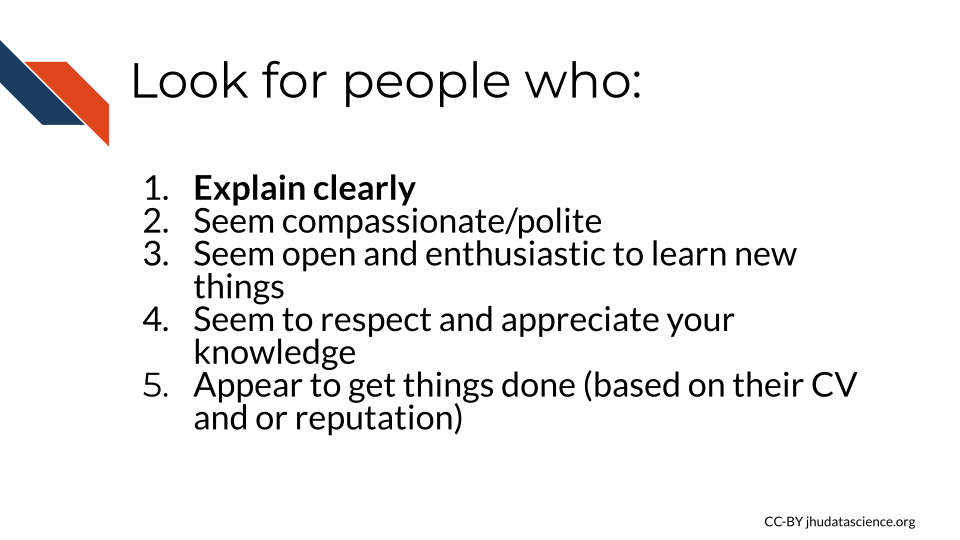
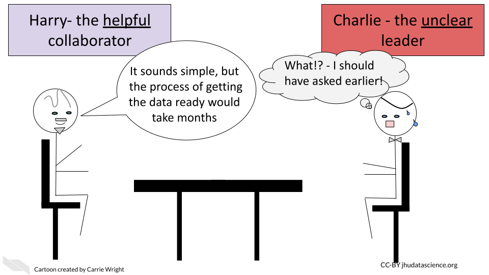
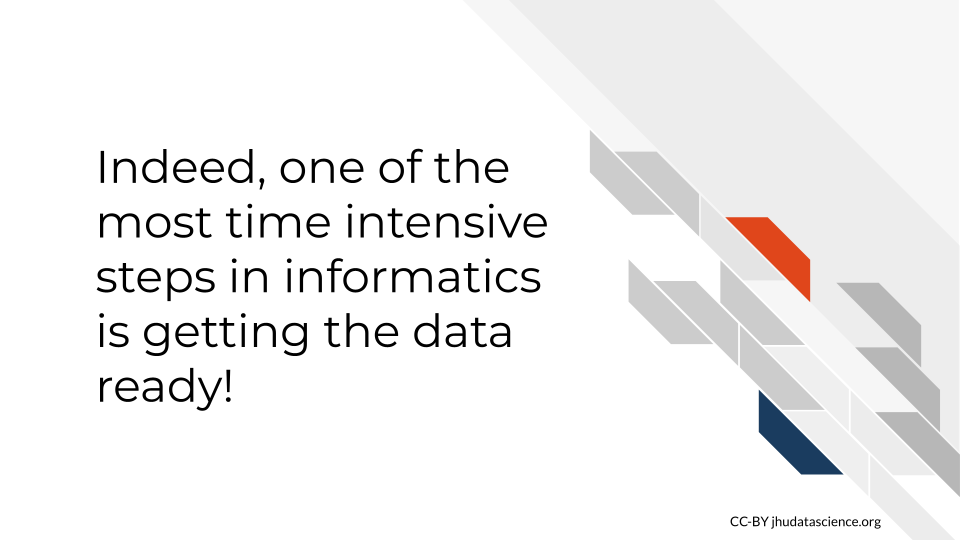
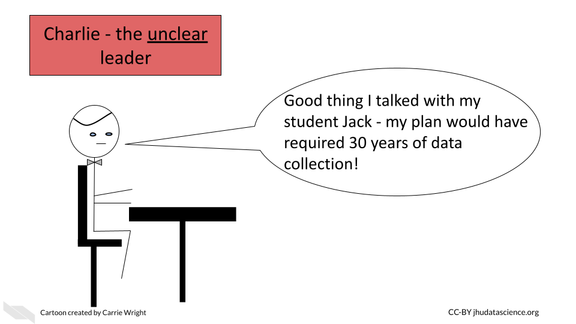
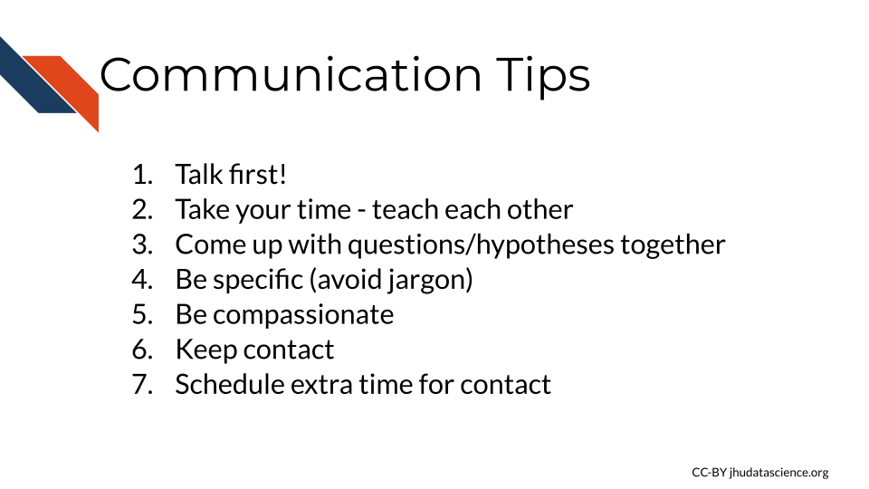
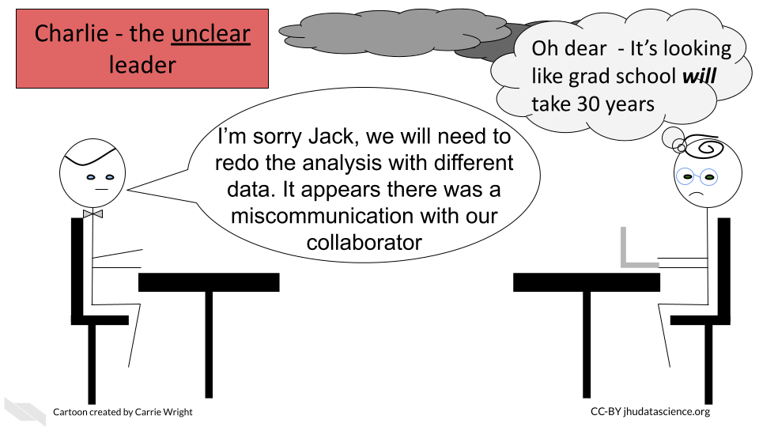
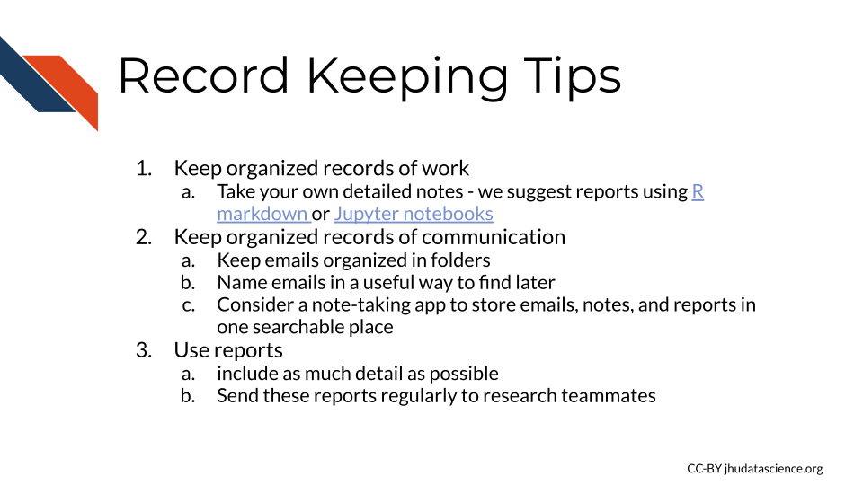
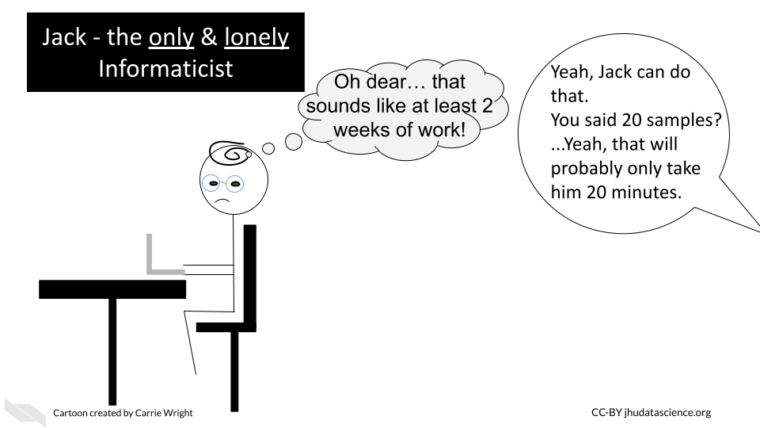

# Guidelines for multidisciplinary informatics teams

In this lesson we will discuss general guidelines for how to create and maintain healthy relationships within a multidisciplinary informatics research team.

## Finding and creating informatics teams

The first step to performing a good research study is to find the right people for your research team. 

In this section we will provide a guide for finding good coworkers, whether they are mentees, collaborators, or employees, to work on informatics cancer projects particularly for multidisciplinary teams.

This section is based on blog posts @peng_finding_2011 from [Roger Peng](http://www.biostat.jhsph.edu/~rpeng/) and @matsui_care_2013 from [Elizabeth C. Matsui](https://www.linkedin.com/in/elizabethmatsui) of the [simply statistics](https://simplystatistics.org/) blog which has many other useful discussions and resources. 

### **Start early**

The key to a successful multidisciplinary project is to start looking for your research teammates **early**.

If you plan to collaborate with an expert, we suggest that you find such collaborators and discuss your plans **before** you even finish designing your studies. 

If you are new to informatics and you plan to employ or mentor informatics experts in your lab, we also suggest that you seek guidance from a senior informatics expert **before** you start an informatics project. 

### **Who to look for**

Especially for projects with multidisciplinary teams, good communication is vital. Look for people who are **easy to talk to**.

 
In Roger's words:

> "If you don't feel comfortable asking (stupid) questions, pointing out problems, or making suggestions, then chances are the science will not be as good as it could be."

Ideally you want to be able to ask your collaborators basic questions, so that you can be sure that you understand the fundamentals correctly. If your collaborator doesn't explain information clearly (without jargon that you don't understand) or doesn't make you feel safe to ask questions, then this will likely result in you missing out on critical information.

This goes hand in hand with finding someone who is compassionate or polite. You never quite know what will happen with projects in Science, thus it is ideal to work with people who can handle difficult situations well and continue to treat others with respect.

An ideal collaborator also has enthusiasm to ask you about your work, including again fundamental questions. Having their newer perspective can be especially helpful for you to think about your work differently and notice anything that you might take for granted.

You also want collaborators that respect and appreciate your knowledge. If there is an imbalance regarding respect, this can result in situations where one collaborator feels like a subordinate to the other. This generally makes individuals feel less comfortable to bring up problems.

Finally, you also want to look for individuals who seem to get things done. You can get a sense of someones productivity by looking at their CV and asking them about their projects. Motivation in collaboration can dwindle due to responsibility being spread across groups, which is why it is so important to find productive collaborators.

 

### **Adjust your expectations**

Be careful about assuming that your experimental collaborator can do any type of wet bench experiment or that your informatics collaborator can analyze any type of data.

> "Computational biology hinges on mutual respect between researchers from different disciplines, and a key element of respect is understanding a colleague’s particular expertise" [@carpenter_cultivating_2021].

> "Computationalists do not like to be seen as “just” running the numbers any more than biologists appreciate the perception that they are “just” a pair of hands that produced the data" [@carpenter_cultivating_2021].

> "Statistics, database structures, clinical informatics, genetics, epigenetics, genomics, imaging, single-cell technologies, structure prediction, algorithm development, machine learning, and mechanistic modeling are all distinct fields. Biologists should not be offended if a particular collaboration idea does not fit a computational biologist’s research agenda or expertise...a computational biologist’s research laboratory often must focus on novel methods development in a particular area for career advancement" [@carpenter_cultivating_2021].

## Communication for informatics teams

Communication is vital for all work relationships, but this is especially true for multidisciplinary teams. Here are a few tips for keeping communication smooth. This section is based on @broman_collaborating_2019 by [Karl Broman](https://kbroman.org/) and @wang_collaborating_2019 by [Jiangxia Wang](https://www.jhsph.edu/research/centers-and-institutes/johns-hopkins-biostatistics-center/about-us/our-people/).

### **Talk first**

OK, so we kinda covered this, but we can't emphasize it enough. We suggest that you start talking to your collaborators, students, or employees  **before** you even begin a project, so that you can plan the project in the optimal way.

This is critical for forming the right informatically feasible and scientifically useful questions and for collecting the right data to address such questions.

Collecting the **right** data can be vital to the success of a project. It may not always be obvious what is possible *or impossible* for the experimental biologists. Is 30 samples actually feasible? How about 300? Would that be performed in different batches?

What is necessary or possible for an informatics project to test certain questions with statistical methods? How long would certain analyses take?

These are discussions that should happen long before reagents are purchased, before IRB submissions, and before grant submissions if possible.

### **Take your time** 

For employees and mentees, allow time to get comfortable talking to one another. As a leader, take the lead in openly expressing areas that are new to you and facilitate an environment where teammates communicate respect for one another's unique knowledge and perspectives. 

In all cases (with collaborators, employees, and mentees), build in extra time for projects to allow for teaching time. You can **teach them** about your domain and **they can teach you** about theirs. This may feel like it is taking extra time but it will ultimately pay off in the end, as you will be better prepared to work as a team and to ask the most **useful and testable** hypotheses.

### **Come up with questions/hypotheses together**

Not knowing what may be feasible in terms of data collection and analysis can make it nearly impossible to form an appropriately testable hypothesis. Furthermore, it may be difficult to know how your questions fit into the context of a field and what is actually useful to advance treatment and prevention if you are not a domain expert of the cancer or disease that you are studying. By working together in multidisciplinary teams we can determine the best hypotheses to advance science. 

Domain experts can help to ensure that the question is feasible from a standpoint of data collection, that it leads to other important questions, that it is new, that it is useful, and that the plan to test it will actually lead to interpretations that are useful.

Informatics experts can help to ensure that the question is feasible from as standpoint of data collection and data analysis, that a question is testable, and that it leads to the interpretations that the domain experts hope to gain.

### **Be specific**

Give and ask for specific feedback. If your collaborator/employee/student says something that you do not quite understand, ask them for more specific clarification. In addition, give feedback that is specific where possible without assuming knowledge that might be necessary and avoid jargon. One way to do this is to reiterate what you think you understood and to describe concepts at high level, and then follow this with detailed descriptions. Include as many details as possible.

For example, if a collaborator simply states that the number of samples would be underpowered, this might not be enough information for you to help solve the issue. Ask for clarification about why with response questions, such as "you believe that the sample size is too small to allow for this specific statistical test (specify the test) to be utilized to identify if there are differences between these specific groups (specify the groups)?". 

Once you get a better understanding about why they might have said this, you can better understand how to solve the issue. In the above example, perhaps you need to consider a different test before considering getting additional samples. Or perhaps you aren't even testing the correct question. Clarifying this first will help.

Additional communication tips include (based on [@haden_5_2014] and [@tips_questions]:

1) Use neutral language. You want to allow your team members to have their own authentic reaction (especially when  it comes to issues). Neutral language might allow them to better realize a solution before they feel threatened by a reaction of stress from you. You also don't want to ask questions that lead your team members to a specific conclusion even if there isn't an issue, so as to allow for more discussion. You can do so by initially avoiding including options or assumptions that you have come up with. However after these open questions you want to start including your own understandings to get more specific.

2) Start with general high level concepts and follow this with more specific comments/questions. 

3) Try to focus your feedback and questions about one specific aspect at a time. Ask your team members to walk through a process with you step by step.

4) Ask your teammates to think about your process as if all of you were entirely new to the process to consider what you might be missing or taking for granted.

4) Plan meetings ahead of time so that you know exactly what you hope to communicate. Write your questions or feedback out so that you make sure you cover everything that you need to. Assess each question and feedback comment for its overall purpose or goal. 

### **Be compassionate**

Consider the stage of the project and how your discussions may impact your coworker.

For example, pointing out that there is not enough data or samples to do what your collaborator had hoped during later stages of the project can be very disappointing as it is often not possible to collect new data. Being polite and considerate when you make suggestions can make a major difference. Furthermore, suggesting an idea about how the project can still be productive can save your collaborator/coworkers/students stress and heartache. They may not be aware that there is public data available or additional data in your lab that can still save the project.

### **Keep contact**

Regular communication continues the momentum of a project and ensures that important details get discussed when necessary. It also relieves anxiety among coworkers by keeping everyone aware of the status of the project and helping to start discussions if someone needs help.  

### **Schedule extra time** 

As a project continues, new challenges will arise that will again require more time for teaching one another about the scientific process specific to your domain. Build in breathing room in the project schedule where possible, to allow for time for setbacks. **Keep in mind that you may be unaware of the setbacks that you may encounter for work outside of your expertise.** Creating a situation that is less stressful makes it easier for everyone to maintain positive relationships.

We will discuss this more in the next chapter.

In summary, we suggest that you follow these tips when communicating with your multidisciplinary team:

## Record keeping practices

Once you have your project rolling, it is important to keep good records of your work, your collaborators work, and your communication. Keeping good records takes time and discipline but it can save you more time and heartache in the end. Here are some suggestions for how to optimize your record keeping.

### **Keep organized records of work**

Record and communicate notes about your data collection and analyses. Be mindful of overwhelming your coworkers, but generally speaking provide extra information where possible. The more people aware of details about what samples were in what batch, the more likely important details are not missed or forgotten. For example if you are sending data to a collaborator send as much information as possible about how it was generated in the email in which you send it to them, even if you have already discussed the data. This can help ensure that no important details fall through the cracks. The best way we think you can do this in general is to use reports - one of our next suggestions.

### **Keep organized records of communication**

Besides recording your work, keep a record of your communications. At a minimum organize your emails for projects into a separate folders with easily recognizable titles to save yourself hassle later when something comes into question. However, we **highly** recommend that in addition for even better record keeping, you copy paste emails and dates to a [note-taking system](https://zapier.com/blog/best-note-taking-apps/). This could be as simple as a shared Google doc, or you could consider an app like [these](https://collegeinfogeek.com/best-note-taking-apps/) that are designed for note-taking.  With many of these you can also share your notes with research teammates and you can include report documents directly in your notes. Which brings us to our next point about using reports!

### **Use reports**

Instead of sending informal short emails (which are useful at some points in a workflow), we suggest intermittently sending lab reports with as much information about what was done and why as possible. For informatics related work in R or Python (or other supported languages) we **highly** suggest using a method like [R markdown](https://rmarkdown.rstudio.com/lesson-10.html) or [Jupyter notebooks](https://jupyter.org/) to track what informatics steps you have performed and why. Beginning these reports with a short description of what raw data you used and when you received it can be critical for ensuring that you are using the correct data! We will describe more about how to use such reports in the final chapter of this course. 

It is also important that the experimental biologists make similar reports defining what reagents they used, when they performed the study, what samples were used, who performed the experiment, and any notes about usual events, such as the electricity went out during the experiment, left the samples overnight but usually leave two hours, mouse #blank unexpectedly died so we lost this sample thus it is not included, or the dye seemed unusually faint in this gel.  

In summary, we recommend the following record keeping tips:

## Leadership best practices

In this section we will describe best practices for lab leaders leading multidisciplinary informatics teams to support their research team members.

The section is based on a famous blog post [@watson_guide_2013]  called "The lonely bioinformatician" that describes the angst that informatics personnel often feel when they are the only person in their lab with their skill set. The blog post author, [Professor Mick Watson](https://www.ed.ac.uk/profile/mick-watson) at the University of Edinburgh, describes these individuals as "pet bioinformaticians" in his blog called [opiniomics](opiniomics.org).

He states: 

> "It is possible they [the pet bioinformaticians] will become isolated and pick up bad practices as they don’t have a senior bioinformatician to guide them. It also concerns me that their career and professional development might suffer."

He also acknowledges the challenges of the opposite case:

> "Consider the opposite situation – how many bioinformatician PIs manage lab staff?  How could we possibly guide a young post doc on how to run gels, PCRs etc nevermind more complicated laboratory SOPs?"

He has since then stated for the PIs of experts who do not share the same skill-sets:

> "Just look after them, and recognise you can’t give them everything that they need. You can give them a lot, just not everything."

> "Secondly, there is nothing wrong with being a pet bioinformatician – it can be a really stimulating role, and opens your eyes to lab-based science.  I am not criticizing the pets either, I just urge you to look after yourselves." 

And ultimately provides a [guide](http://www.opiniomics.org/a-guide-for-the-lonely-bioinformatician/) for the "pet bioinformaticians" that can be useful for both informatics expert employees/mentees and also for leaders of such individuals as well as for informatics lab leaders who employ lab-based scientists.

Extending the major themes from [his guide](http://www.opiniomics.org/a-guide-for-the-lonely-bioinformatician/) and from his post about clinical labs [@watson_lonely_2014] here are guidelines for multidisciplinary research lab leaders:

### **Recognize that different disciplines require deep expertise**

Informatics is truly it's own scientific discipline that requires deep expertise. 
To truly optimize the multidisciplinary work that you may wish to perform, you need expert-level experience of all disciplines on your team. Although you may be able to learn how to use a particular tool to seemingly test an hypothesis, this may not be correct or optimal in every instance. This is why you need expert-level informatics team members to help you with your research. If you can't hire such an individual, or even if you hire a more junior informatics mentee or employee, you need to discuss your research with a senior informatics expert. 

### **Avoid employee isolation**

If possible, employ more than one domain expert or at least collaborate heavily with others - especially those with experience working with human data. Alternatively hire a more senior expert (with expertise studying in the domain you intend) with a higher salary.  

In Mick Watson's words: 

> "I am aware of a few lone bioinformaticians working in clinical labs.  I want to make this clear – this is a bad idea.  In fact, it’s a terrible idea.  Through no fault of their own, these guys will make mistakes.  Those mistakes may have dire consequences if the data are then used to inform a treatment plan or diagnosis."

In any case, we highly encourage guideline #2 regardless of what option you choose.

### **Encourage relationships with others in their domain**

Enable and encourage your employee to cultivate relationships with others who have similar skill-sets at your institution or local community.  Ideally, help your employees or mentees find a **mentor within their domain**. If there is no local group of such individuals, see if your employee would be interested in starting one - such as a seminar group or journal club. Also encourage them to join online forums and attend conferences and workshops.

Examples include: 

 - [R ladies](https://rladies.org/) for support for using Bioconductor or R programming. Many of the members are also very familiar with using a variety of genomics and imaging data. You do not need to be a woman to get support from this organization. 
 
 - Many universities have a statistical support group, check at your institution. 
 
 - [National Cancer Institute ((NCI) hub groups](https://ncihub.org/groups/browse) has a list of cancer specific groups such as large groups like the [Informatics Technology for Cancer Research (ITCR)](https://ncihub.org/groups/itcr).
 
 - Consider location specific groups/collaborations such as the [African Esophageal Cancer Consortium (AfrECC)](https://dceg.cancer.gov/research/cancer-types/esophagus/afrecc).
 
 - When in doubt, ask around. Ask at your institution, ask your former colleagues at other institutions, or try on social medial like twitter to find connections.

### **Encourage growth outside their domain**

On the other hand, it is important that you also cultivate and encourage your employee's growth in your domain by again suggesting and enabling their participation in conferences and journal clubs on topics relevant to your lab.  

### **Value their perspective about science in general**

Encourage feedback and discussion from all of your employees in scientific discussions. Make their input feel welcomed regardless of the topic. A fresh perspective can sometimes lead to really important insights about things that are taken for granted by experts.

### **Discuss expectations and hypotheses**

If your employee is helping with work for a grant, provide the proposal to them. Have a discussion with your employee about your expectations and how feasible they are, as well as to make your informatics hypotheses specific. Avoid projects where the informatics goals are vague. Also remember that many informatics tasks may take more time than you anticipate and your employee may have a better sense of how long something will take (or vice versa if you are an informatics expert employing lab scientists). Be clear with your employee in these discussions that you are unclear about how long tasks will take, if that is indeed the case. Continue to have open dialogue about expectations and goals as the work proceeds.

### **Advocate authorship and idea generation for all**

Regardless of your employees' or students' backgrounds, make sure you advocate for authorship for each of them (particularly if they are interested in a career in research). 

According to a recent report about computational biology:

> "Despite the fact that dramatic advancements have been driven by computational biology, too often researchers choosing this path languish in career advancement, publication, and grant review" [@carpenter_cultivating_2021].

It is often overlooked, but informatics experts will also need **first author papers**. However, keep in mind that in some fields authors are listed in different ways. 

Allow your employees to **generate ideas** for such publications and discuss this with them. Often the work to help with other projects may not be as interesting for your employee as an idea that they come up with themselves. 

Often you can create one technical paper and one biological paper from each project.  For technical papers, allow your lab members that largely do informatics to play a prominent/leadership role. For biological papers, ask them to play a supporting role. For experimental lab members do the opposite. Allow these lab members to have a prominent role on biological papers and a supporting role on more technical papers.

If nothing else, even if your employee is very busy on work for mid-level authorship, give them time to write a review or a software paper for a simple package, or a comparison of informatics methods. [Mick Watson](https://www.ed.ac.uk/profile/mick-watson) suggests making sure that your employees are authoring ~2 first author publications a year if possible. If necessary you can front-load collaboration work and then give your employee more time later to spend on their own work, but be careful about not protecting some of their time for their own career advancement. Also please see the [Career Paths for Informatics Mentees section](https://jhudatascience.org/Informatics_Research_Leadership/informatics-relationships.html#career-paths-for-informatics-mentees) (coming up soon) and read it with your employees in mind, as well. 

### **Check on them!**

**Most importantly**, make sure that your employee is getting help and feedback from other experts in their domain. It can be easy for your employee to get stuck or go in the wrong direction if left in isolation. How can you prevent this from happening? Keep tabs on what they are doing in general, if they are still working on the same issue for an extensive amount of time, suggest that they seek help. Also by encouraging your team members to cultivate relationships with experts you will provide them with the opportunity to ask others for their thoughts. 

### **Get external review of work**

Particularly in informatics, we can especially track our steps. Make sure that your employees are keeping detailed records about their work and then get them to regularly ask for feedback from others. We all make mistakes, it's good to get external feedback early and often to ensure that the work is correct.

### **Support diverse teammate work schedules**

One other important thing to know is that informatics work is often best performed with long stretches of uninterrupted time to allow your informatics employees to perform "deep work". 

Why is this? Some of the challenges that your informatics teammates will be working on will require a great deal of abstract thinking and troubleshooting. Such difficult work profits well from deep concentration. 

How can you accommodate this? Try to work with your informatics teammates to schedule lab meetings and be mindful of other time commitments they might have, such as classes, seminars, or other meetings.

On the other hand, if you are an informatics expert mentoring experimental biologists, keep in mind that their experiments will dictate their schedule. Impromptu meetings may be difficult for them at times. Also be aware that some of their experiments may require that they stay late at night or come in very early. Thus on those days, it might be best to not overburden them with other tasks if you want them done well.

## Conclusion

We hope these leadership guidelines will help you to better support your lab team to be as successful as possible! 

In conclusion, here are some of the take-home messages:

1) Look for collaborators early in the process, particularly those that explain clearly.
2) Take your time and expect delays. Reduce stress by scheduling extra time where possible.
3) Keep organized records of communication and analyses.
4) Recognize that different disciplines require deep expertise. Thus help your mentees find mentors for their respective disciplines if it is different form your own.
5) Advocate authorship for all of your mentees (including first authorship).
