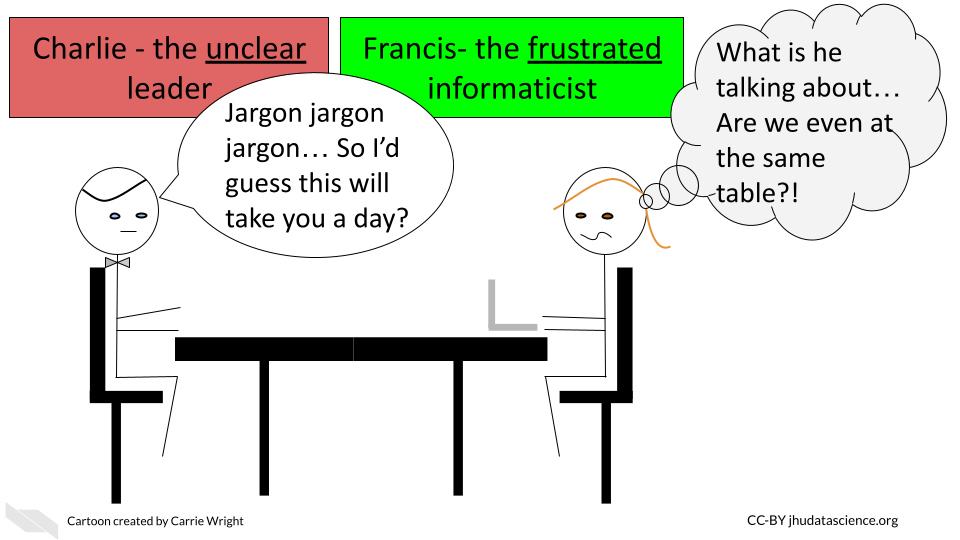

# Informatics relationships

## Cultivating good multidisciplinary lab relationships

Now that we know a bit more about general practices for maintaining successful multidisciplinary teams and projects, we are going to take a deeper look at how to best support the relationships that might have in our team. We will also discuss the pros and cons of each type of relationship to better guide you about decisions regarding building your team.

## Collaborating with informatics experts

Studies investigating biology research labs over history indicate that collaboration has been on the rise since the 1950s [@vermeulen_understanding_2013] and that the rate continues to increase [@sonnenwald_scientific_2007]. Indeed the size of biology research teams appear to have doubled from 1955 to 1990 [@vermeulen_understanding_2013]. But why? 

### The benefits of collaboration  

1) **Shared cost** - Research often involves expensive technology, thus it is cost effective to share resources. 
2) **Shared expertise** - Now that technology affords answering in some cases more complex or broader research questions, it is often more effective to employ multiple contributors with different knowledge, skills, and perspectives. Researchers have noted that their own concept of their field changed as a result of working with investigators from other disciplines. Thus this can lead to innovation [@makinen_patterning_2020].
3) **Shared burden** - Doing part of the work for a project using the knowledge and skills that you are most comfortable with and seeking help from others who are more knowledgeable on other research aspects can be a more efficient strategy.
4) **Shared reliability** - Including multiple team members who can each evaluate the research can improve the reliability of a project, as mistakes can be found by other members.
5) **Shared credibility** - Collaborations involving experts of multiple areas can improve the perceived credibility of the work by others.

### Potential challenges

There are always challenges when collaborating with others, but some of these are particularly enhanced in multi-disciplinary teams. Here are some challenges that you may encounter when a collaboration involves informatics experts.

Bad collaboration:

1) **Communication Differences** - Extra care needs to be taken to ensure that communication across groups is effective.  

Typically researchers will not meet as often with a collaborator as they would with an internal team member. Therefore, poor communication in a collaboration can lead to more costly misdirection and thus wasted time and effort.

Furthermore, as investigators often have different backgrounds, differences in jargon and language can make communication more challenging. 

Having **internal** team members with some **familiarity** with informatics can be very beneficial for translating discussions with collaborators who are informatics experts. 

One solution to this is to have **trainees work in both labs**. This can be especially beneficial for the trainee who will become accustomed to two research styles and will learn a diverse set of skills. This allows the trainee to potentially have their own multi-disciplinary lab in the future [@makinen_patterning_2020]. 

Another important method that can help resolve this issue is to have members provide **educational seminars** for participating members about the fundamentals of their work.

2) **Different research style and goals** -  Beyond differences in language, differences in research style and goals can lead to conflict.

>"Scholars’ different styles of thought, standards, research traditions, techniques, and languages can be difficult to translate across disciplinary domains" [@makinen_patterning_2020].

Making clear research standards and goals, as well as outlining clear specific tasks at the beginning of a project can help to avoid this issue. Furthermore, meeting consistently throughout the duration of a project can also help to make sure that standards are maintained.  Additionally, these meetings should include discussions about intellectual property, authorship, leadership, and defining what success looks likes to each of the various members. Defining these details early can avoid major conflict later. 

Furthermore, it is critical to keep in mind the diversity of career goals of research team members, as junior team members may have a challenging time persuading others of their independence and contributions when they work on largely collaborative projects.  It is also necessary to ensure that junior members have time to devote to their own research programs. [@sonnenwald_scientific_2007] Support should be provided for these junior collaborators by more senior collaborators.

3) **Different capabilities** - Research of multi-disciplinary collaborations has revealed that when collaborating members are unclear of how their expertise and work contributes to the project, they are less motivated and fell less valued. 

Working with members of different backgrounds to determine how their expertise can contribute to the project, as opposed to simply assigning them a task, will not only help with morale, but it can also better define how a collaborator can further contribute to a project in ways that you may not already expect [@makinen_patterning_2020].

4) **Reduced sense of responsibility** - Another concern of collaboration is that team members may feel less responsibility or commitment to a project than for a project within their own lab.

Defining tasks and expected due dates can help reduce this issue. Discussions to establish due dates should **always include** team members with **expertise in each area** of science, as tasks may not take the amount of time that another researcher would expect. It is a common misconception that informatics tasks take less time than the tasks actually take in reality. 

5) **Research is dynamic** - Research always has an element of trial and error. Protocols may change and new scientific questions may emerge. Frequent meetings with all group members to understand the dynamics of the project are critical. Furthermore, flexibility and understanding is required. It should be expected that aspects about the project will change.

6) **Different levels of resources** - Particularly when collaborating with community members, community colleges, and institutions that are "Equity-oriented" and serving populations that have historically been marginalized or "minoritized" [@blake_case_2017], it is important to keep in mind that large differences in resources may exist between collaborating members. 

Sharing and discussing budget information early and often can help research members to understand what expectations are reasonable and how collaboration partners may best assist one another.

It is also important to recognize that:

> "There is a common misconception that the lack of physical experimentation and laboratory supplies makes analysis work automated, quick, and inexpensive" [@carpenter_cultivating_2021].

However:

> "In reality, even for well-established data types, analysis can often take **as much or more time** and effort to perform as generating the data at the bench. Moreover, it typically also requires pipeline optimization, software development and maintenance, and user interfaces so that methods remain usable beyond the scope of a single publication or project" [@carpenter_cultivating_2021].

Don't forget to provide some budget for your informatics collaborators, as their time ultimately does cost money and there may be computational costs that you may not be aware of. 

## Employing informatics experts

In contrast to collaborating with informatics experts, in some case it may be beneficial to directly employ them on your team. There are again pros and and cons for this strategy.

By directly employing informatics experts, rather than collaborating with an expert, research leaders will have more access to meet with these experts more often. Research leaders may also have more sway in terms of guiding the direction of the experts' work. Leaders can also potentially grow the informatics part of their research program more readily, leading to even more flexibility in the research questions that they may be able to assess.

However, direct employment of informatics experts requires all of the typical responsibilities and costs of employing another lab member. It also requires the additional resource requirements for the informatics work of the particular expert.

In addition, it is useful to become familiar with best practices for ethics, reliability, and reproducibility in computational work. This requires some different tactics than that of experiment based research (often called "wet lab" research). Although it is also useful for informatics experts to keep track of the work that they have performed in general, similar to maintaining notes about experimental research with a lab notebook, a much deeper level of detail can be tracked and maintained for computational work. What we mean by this, is that the actual code and data used in their work can be saved over time. This can be invaluable for research reproducibility. Thus research leaders are advised to become familiar with best practices for data sharing and data management so that they can most effectively manage their informatics employees. This is also discussed in more detail later in the course.  

One other important thing to remember is that informatics work is often best performed with long stretches of uninterrupted time. This will be true for your informatics employees and mentees.

Again we suggest that you work with your informatics teammates when you schedule lab meetings and be mindful of their other time commitments. Try to support them in scheduling several hours of uninterrupted time a day if possible. 

As a reminder, again unless you employee a senior informatics expert and even then - it is advisable that you encourage these employees to make supportive relationships with other informatics experts, and particularly if they are working in a new domain. 

## Mentoring informatics students

Mentorship is a particularly unique relational experience. While traditional mentorship has been defined by the hierarchical structure of a single mentor who teaches subordinate mentees, new styles have emerged that are not as constrained or limited as the traditional paradigm. At its optimum, mentors and mentees should **learn from each other and together** and expand what each can do alone. Importantly the more traditional paradigm that does not value "reciprocal learning" as highly, has been shown to be less effective for a larger diversity of students [@mullen_defining_2021].

For research groups that are newer to informatics, some of these less traditional paradigms may be especially useful, we will focus on a few here. 

### Co-mentoring/collaborative/team mentoring

As we described earlier, co-mentoring or collaborative mentoring of students by multiple mentors with different backgrounds can be particularly beneficial to the student and also to the partnering labs. In the case of collaborative mentoring where a mentee is mentored by two research experts in two different labs, this provides an opportunity not only to strengthen a collaboration, but also for students to gain more diverse knowledge, and to in turn provide more of the expertise that they gain back to both labs. Co-mentoring could also occur within the same lab by a research leader and an informatics expert. This could also work well in a multilevel paradigm, where an informatics expert may guide informatics related aspects of research, while an overarching research adviser may guide the student's overall research mentorship experience.

### Peer mentoring

Peer mentoring also provides great opportunities to expand students' expertise and skills without as much time constraints for the research leaders of a lab, particularly for skills that may be new to lab leadership. Furthermore, such paradigms are helpful for improving students' teaching skills, collaboration skills, self-reliance, and self-confidence. Teaching a peer is often useful for students to identify gaps in their own knowledge and assisting in their quest to "learn how to learn" [@mullen_defining_2021]. Furthermore, such paradigms appear to be especially beneficial to students of historically marginalized populations [@mullen_defining_2021]. 

However, there are challenges for research leaders from a management standpoint. Mentors should be mindful of any conflicts that may arise between students. These can often be avoided with clear and distinct goals and projects for students, to avoid making students feel like they are competing with one another. Additionally, we highly recommend establishing a [code of conduct](https://i-sight.com/resources/18-of-the-best-code-of-conduct-examples/) for the lab, so that students and staff members are clear about what behavior is expected.

### Electronic mentoring 

With the COVID-19 pandemic, the transition to using electronic means of contact with students and staff for research has expanded on an unprecedented scale. It is unclear currently how much this will continue in the future. However, research prior to the pandemic has shown some surprising benefits of providing mentorship through electronic means. Importantly, it appears that this eases burdens for students who are balancing course work, as it often provides more scheduling flexibility. Additionally, such mentorship is particularly helpful for historically marginalized populations who may face more hostility by going to research institutes with face-to-face interaction with others or may have additional scheduling conflicts. Even as we may return to more on-site research labs, additional availability by mentors with mentees using electronic means of contact are likely to be beneficial. Technology such as [slack](https://slack.com/) can be especially useful for allowing lab members to interact with one another. We will cover more about this soon.

### Career goals 

The job landscape for scientists has changed in recent decades with more opportunities outside academia in industry and government. Furthermore career goals for informatics mentees can be very different than that of other research mentees. By having informatics expertise, these trainees have **additional career opportunities**. 

Becoming aware of these opportunities yourself, as a research leader, is therefore critical for cultivating your mentees' awareness of the diversity of opportunities available to them. This will ultimately allow your mentees to choose the career path that suits them best. 

#### Career paths for informatics mentees

1) **Academia** - Your informatics mentees may have career opportunities as principal investigators, scientists, or educators just like other cancer biology mentees. In addition to opportunities as educators for informatics and biology, they will also have opportunities for data science.

2) **Government** - Your informatics mentees may have career opportunities as scientists or policy makers for research institutes just like other cancer biology mentees. However, additional agencies and institutes may have a need for their data science skills on topics outside of biology. For example your mentee may have the skills to work for a city police department.

3) **Industry** - Beyond the potential career options in the pharmaceutical industry, biotech, and medicine, your informatics mentees will have data science skills that may qualify them for jobs in a variety of industries. For example
your informatics mentees could find jobs at companies such as [Stitch Fix](https://www.stitchfix.com/) or [Ancestry](https://www.ancestry.com/) which use methods in machine learning and bioinformatics for their products. Additionally, your mentee may also have opportunities to join a software company as a computer programmer or even as a programming educator at a company like [RStudio](https://rstudio.com/). 

4) **Nonprofit** - Beyond research and management positions at nonprofits performing scientific or clinical research, informatics mentees may have opportunities at other nonprofits with other types of goals. For example, your mentee might find work at a nonprofit that advocates for civil rights and investigates social interactions on social media platforms.

#### Career paths outside of academia

If your mentee is more interested in a career path outside of academia we suggest you read up about industry perspectives on useful skills and knowledge, so that you are better prepared to guide your mentees to get exposure and experience to the data science domains or aspects that would be most helpful to them. 

According to [Brandon Rohrer](https://www.linkedin.com/in/brohrer/), a data scientists who formerly worked at [Facebook](https://en.wikipedia.org/wiki/Facebook) and now works at [iRobot](https://en.wikipedia.org/wiki/IRobot), there are 4 major categories of knowledge and skills for data science:

1) **Data Analysis** - domain knowledge, research skills, and interpretation skills  
2) **Data Modeling** - machine learning application skills and algorithm development skills  
3) **Data Engineering** - data management skills, skills to make code production-level ready (ex. automation), and software engineering  
4) **Data Mechanics** - data formatting and cleaning and data handling (filtering, subsetting)  

Based on these categories, he says that there are also 3 major archetypes (with subdivisions) for data scientists:

1) **Beginner data scientists**  
These are individuals just starting out but who are familiar with each of the 4 above areas. This is ideally how your mentee will be after training (at a minimum) if their goal is to pursue a data science career. This will allow them to identify their strengths.
2) **Generalist**  
These are individuals who are proficient in all areas. This is helpful for becoming a data science **manager or executive**. Focus on all  4 aspects of data science is also good for mentees who wish to **stay in research**!
3) **Specialists**  
There are 3 major subtype specialties:  
 - **Detective** - strong skills in data analysis and mechanics and exposure in all 4 areas - may be especially useful for working at **nonprofits**
 - **Oracle** - strong skills in modeling and mechanics - this is great for working at **companies using machine learning**
 - **Maker** -  strong sills in mechanics and engineering - this would make your mentee valuable for working in any of the nonacademic fields as well as academia
  

Check out this video for more details:

<!-- 
<iframe width="560" height="315" src="https://www.youtube.com/embed/M_dc-XzApGA" frameborder="0" allow="accelerometer; autoplay; clipboard-write; encrypted-media; gyroscope; picture-in-picture" allowfullscreen></iframe> 
 -->

<iframe src="https://www.youtube.com/embed/M_dc-XzApGA" width="100%" height="400px"></iframe>

From another perspective, the major skill sets to focus on according to the "Build a Career in Data Science" book by Emily Robinson and Jacqueline Nolis [@robinson_build_nodate] are:  

1) Statistics  
2) Machine learning  
3) Programming (python and R)  
4) Projects - hands on experience  

Promoting your mentee's exposure to each of these domains can only help them further pursue a career in data science. 

We also suggest that your mentees checkout this [blog post](https://blogs.oracle.com/datascience/how-to-survive-your-data-science-interview) on surviving data science interviews also by Branden Rohrer. We think this could be helpful for mentees pursuing any data science career path, however it is especially useful for those interested in industry.

#### Academia for informatics mentees

So how do we best support informatics students that want to stay in Academia?

1) **Recognize that academic promotion for informatics experts is currently not very accommodating.** 

Some aspects of traditional academic promotion are simply not set up to accommodate informatic experts. For example, these individuals tend to publish many more secondary author publications and create software which can reduce the time they have available for first author publications. However, first author (or last) author papers are still most often used as the major guideline for academic achievement. How can you and your mentees overcome this?

Be sure to **especially advocate** for your student to get first authorship papers if they intend to stay in academia. 
Wherever possible also try to advocate for more nuanced academic promotion polices that account for multidisciplinary differences at your institution.

2) **Encourage your student to seek specialized technical skill sets**  

For your students who wish to stay in academia, it may be less important that they become as generally familiar with a wide variety of data science skills and practices as students interested in a career outside of academia, if they are for example focusing on a specific statistical method. Just like other academic fields, informatics experts will become experts in niche subject areas. Encourage these students to go to targeted conferences to build a network in their field of interest (although we still encourage if possible to allow your students to get a well-rounded exposure to different types of conferences). Also especially encourage these students to learn about grantsmanship just as you would with your other academic mentees. However this can also be useful for students interested in working for a nonprofit or for the government. 

See @carpenter_cultivating_2021 and @waller_documenting_2018 for a more in-depth discussion and suggestions on how we can work to reform academic promotion practices to be more mindful of disciplinary differences for informatics experts.

#### Authorship considerations

In addition to typical biological papers, there are also other companion types of papers that your informatics mentee can  publish, including:

1) **Data resource papers** - your mentee may publish an article introducing a data resource
2) **Software papers** - an article where the functionality and development of piece of software is discussed
3) **Method comparison papers** - your mentee may compare existing methods
4) **New method or pipeline papers** - your mentee could describe a new method that they created

These other types of papers are especially good to keep in mind if your mentee will not be first author on a biological paper from your lab.

When guiding your mentee through the publication process, it is a good idea to keep in mind their career goals as you prioritize different paper ideas. For example a mentee that is interested in pursuing a data engineering career may benefit more from a software paper, while a mentee interested in staying in academia would benefit more from a new method paper or a biological paper if possible. Most importantly, remember that informatics mentees need first author publications too!

## Conclusion

We hope that these tips help you to mentor and lead your team in a more productive and effective way that benefits both your team members and your lab's mission!

In conclusion, here are some of the take-home messages:

1) There are many challenges associated with collaboration, however early and regular communication can help. It is also helpful to outline expectations early on.
2) Becoming familiar with best practices for ethics and reproducibility is helpful for employing a computational biologist, especially if you are new to computation biology. Possibly consider learning a bit of code to better understand what your computational employees are doing if you yourself are not already familiar.
3) Remember that mentoring is a reciprocal process. There are many alternative strategies for mentoring that you may find helpful.
4) Remember to discuss with your mentees about their career goals. The way you advise them should be driven by their interests.
5) Organize projects so that your team can produce biological and computational manuscripts.
