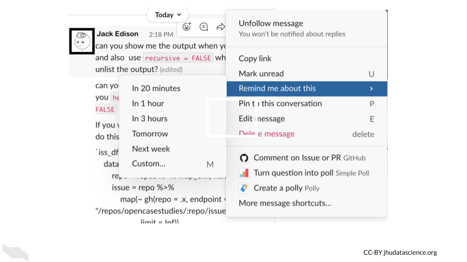
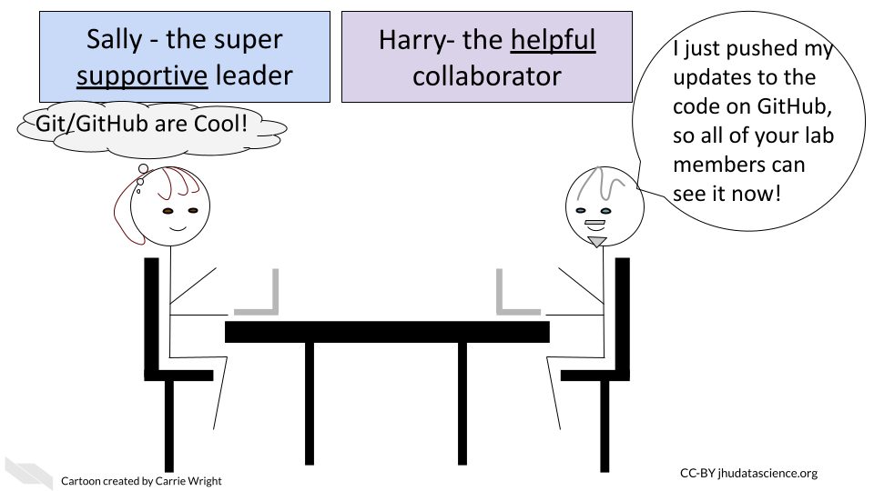

# Informatics lab management tools

There are several tools that can be especially useful for assisting with day-to-day management of projects involving informatics regardless of if you are simply collaborating with an informatics expert or you are leading an informatics research team.


## Slack


[Slack](https://slack.com/) is a communication tool that allows you to communicate with lab members much more efficiently than email. It is a bit like a combination of an instant message system, email, and Dropbox.


<iframe src="https://www.youtube.com/embed/q19RtuCHt1Q" width="100%" height="400px"></iframe>

You can do quite well with the free version of Slack. It may be all that your research group needs indefinitely. The major difference between the free version and the paid versions is that the free version does not save all of your message history.

Currently, with the free version you can search through the history of the last 10,000 messages. From our experience using this with a department with about 250 users, it takes about a year to reach this threshold. If you choose to go with the free option and share any really important messages or files, make sure to save them just in case.

Now we will guide you through a bit about how to use Slack.

### Workspaces

The main landing page for Slack is called a workspace, which looks like this:


In the above image, this person has five workspaces which are indicated by the squares on the far left. Each workspace allows for multiple channels for communicating. These channels can include all members of the workspace or specific subsets of members. Team members can also have separate direct messages to have one-on-one discussions.

It's a good idea to check if your department or institute is already using Slack. If so, they may have a workspace that you can join. Otherwise you may want to think about recruiting your department or institute to start using Slack. In this case you could start a workspace where people outside your research group can communicate. This would still allow you to have group messages with your lab or specific groups within the lab. Otherwise, you can start a workspace just for your research group.

### Channels

Channels are the main way in which you can converse with your team on Slack.

We recommend making a Slack channel for your entire research group. Everyone in your group will be able to discuss something by sending messages in real time. If someone is not available at that time, they will see the message when they next check Slack.
We also recommend making project specific channels. For these channels you can add all of the team members working on a specific project, so that they can easily discuss and review discussions about the project.

Importantly, you can make channels private or public. If a channel is public, anyone in the workspace can join.


### Pins

If someone sends a really important message, like a link to a relevant document, you can "pin" the message so that it is easier to find later.

Hovering over a message you will get the following options:


Clicking on the 3 dot button allows you to do several useful things for a message including pinning it to find it easily later.


### Code
One great feature about Slack, is that it is very convenient to message about code.


You can also attach files directly to messages just like in the above message which has a screen shot image file.

### Reminders

If you want to be reminded about a message in 20 minutes or next week you can also do that using the same hovering and 3 dot button option.


Thus if Jack gets a message from his advisor Charlie, but he is busy doing deep work on something else, he can ask Slack to remind him later.




You may also notice in the image above that your messages can be **edited!** unlike an email, in addition you can mark them as unread, which can also be useful for responding to messages asynchronously.


### Polls

One other nice feature for working with a team is that you can directly poll your team. This requires enabling this feature, but it can be super useful.


Say sally wants to schedule a meeting with the lab teammates for a specific project- this could even include collaborators who are outside of the lab. If all the users are on the same Slack channel, she can send out a poll like this one asking people to respond with times that they are available.


If you want to learn more about what you can do with Slack, check out these other awesome [integrations/Slack apps](https://www.paymoapp.com/blog/best-slack-apps/)!

## Git and GitHub

Informatics work can especially benefit from keeping track of your steps and the code that you have used. In some cases your lab may use a tool like [Galaxy](https://usegalaxy.org/) which has built in options for keeping track of the steps that your lab members are taking during their research. However, other tools do not have this option. Instead, we can use a tool called [Git](https://git-scm.com/) which allows for something called ["version control"](https://git-scm.com/book/en/v2/Getting-Started-About-Version-Control).

[Version control](https://en.wikipedia.org/wiki/Version_control) is the tracking of changes to a file or files overtime. This is equivalent to saving different versions of a grant proposal overtime. However, as you may have noticed, this is not an easy process to maintain. Tools like Git (Git is one of the most popular) help us to keep track of changes. If we save our changes often, we can easily modify our files back to a recent version if necessary. This may be less useful for a grant proposal (although we would argue that it really can be!), but it can be absolutely critical for your informatics code.

Why is this?

Small changes in your code may result in your code breaking or generating completely different results. To make matters worse, sometimes your code files may be lengthy, if you have 4,000 lines of code (or more!), it can be difficult to identify what is different between one version and another. Git really helps with this.


So what is [GitHub](https://en.wikipedia.org/wiki/GitHub)?


[GitHub](https://github.com/) is a free hosting site for code (or other files - including those grant proposals!). Therefore, all the different versions of your files can be saved and accessed online at GitHub. You can make these files private or public.




According to Wikipedia:

> As of January 2020, GitHub reports having over 40 million users and more than 190 million repositories (including at least 28 million public repositories), making it the largest host of source code in the world.

You do not have to use GitHub to use Git. If you have data that needs to be complaint with HIPAA, you could still use Git on a local server (more on this in other courses). Alternatively, you could use GitHub after you de-identify your data.

See [here](https://github.com/truevault/hipaa-compliance-developers-guide) for info about ways to use GitHub for data that needs to be HIPAA compliant.

We recommend [this tutorial](https://happygitwithr.com/) if you are interested in using Git and GitHub with R.

## Docker

If you have multiple team members modifying code for a pipeline or some software, or if you ultimately want to share your code, it is recommended that you use a method to ensure that you (as well as you in the future!) and your team and anyone you want to share your code with uses the same dependency software of the same versions! There are a few ways to do this, but one of the simplest is to use what is called Docker.

You might be familiar with something called a [virtual machine](https://azure.microsoft.com/en-us/overview/what-is-a-virtual-machine/). A virtual machine basically allows you to perform operations on your computer, but as if you are using a different computer! This is handy because you can ensure that you not only have similar software installed but you are also working with the same [operating system](https://edu.gcfglobal.org/en/computerbasics/understanding-operating-systems/1/) as your teammates (even if your computer has a different operating system). For example you might have a Mac, and your teammates might all have Windows machines. Pretty cool, right!?

Docker is similar to this, except it uses what is called a container. This allows users to work with software that is preinstalled and an environment that is preconfigured, however it uses part of your existing operating system. This is good because it means that it takes less time and resources than using a virtual machine, which includes a full copy of a virtual operating system.

Here is the [explanation](https://www.docker.com/resources/what-container) about what containers are on the Docker blog:

> A container is a standard unit of software that packages up code and all its dependencies so the application runs quickly and reliably from one computing environment to another. A Docker container image is a lightweight, standalone, executable package of software that includes everything needed to run an application: code, runtime, system tools, system libraries and settings.

See [here](https://www.backblaze.com/blog/vm-vs-containers/) and [here](https://www.bogotobogo.com/DevOps/Docker/Docker_Container_vs_Virtual_Machine.php) to read more about the differences between virtual machines and containers like Docker. Note that you can use Docker containers within a virtual machine. See [here](https://www.datto.com/blog/whats-the-difference-host-vs-guest-os#:~:text=The%20host%20operating%20system%20is,used%20in%20a%20virtualized%20server.&text=Host%20OS%20also%20use%20container,the%20application%20in%20a%20server.) for explanations about host and guest operating systems. In short the host operating system is the local machines operating system (the one with the hardware), the guest operating system is the virtualized operating system.


Finally, see [here](https://phoenixnap.com/kb/docker-image-vs-container) for a deeper explanation about how Docker images and containers work.

Like GitHub, there is a Docker Hub, where people store different Docker images (which is what allow people to run a Docker container with all of your software dependencies and configurations on their machine).You can download other people's Docker images, or you can host your own on Docker Hub for other people to use your Docker images.

The important take-home message is that Docker fixes the issue of having your code work only on your machine but not on someone else's machine.

## Figshare

Similar to GitHub, [figshare](https://figshare.com/) is another option for hosting and sharing files on the internet. However, it is specifically designed for research related files. Users can host data, code, images, posters, papers, and other types of files to allow others to easily find resources related to research.

In their words:

> Figshare is a repository where users can make all of their research outputs available in a citable, shareable and discoverable manner.

> We make it as simple as possible to make research **Findable, Accessible, Interoperable, and Reusable (FAIR)**.

> Publish research in any file format and assign an institutionally-branded DOI,  document with customizable, discipline-specific metadata, [create] discoverable content across major search engines and academic frameworks.

The difference with GitHub is that it is easier to make files **citable** (thus ensuring better that you get credit) and it also is a bit easier to store large data files. Figshare does not however have the same version control capabilities of Git and GitHub. Ultimately figshare is a great place to share the **final** versions of your research products to make them findable for others.

Figshare also encourages researchers to publish negative findings that did not ultimately end up in publications to reduce redundancy in the research field, which we think is a great idea!


<!-- <p align = "center"><iframe width="560" height="315" src="https://www.youtube.com/embed/_q50OWkz4Kc" title="YouTube video player" frameborder="0" allow="accelerometer; autoplay; clipboard-write; encrypted-media; gyroscope; picture-in-picture" allowfullscreen></iframe></p> -->

<iframe src="https://www.youtube.com/embed/_q50OWkz4Kc" width="100%" height="400px"></iframe>

## RStudio and R Markdown

If your research teammates are using the R programming language often, we strongly suggest that you consider having these teammates use what is called R Markdown to create **reports** of their analyses. R Markdown is a flavor of a [markup language](https://en.wikipedia.org/wiki/Markup_language) called [Markdown](https://en.wikipedia.org/wiki/Markdown) that works especially well with R. What do we mean by markup? A markup language is a language for formatting text, particularly to make text that can be distinguished form the rest of a document. In our case we want text to look different from our code and from the output of our code.


Ideally for the sake of reproducibility and transparency, we recommend that your informatics teammates write such R Markdown reports as they are performing their analyses - not afterwards. [RStudio](https://www.rstudio.com/) is an Integrated Development Environment or IDE for developing code that makes it easy to write such reports.

R markdown files make it easy to have a report that shows a bit of the data (or all the data if your data is very small), the code, commentary about what the code is doing, as well the actual output of the code for a given informatics process.

We also recommend describing (in one document) what data you used, who performed the analysis, when they performed it, and how they performed it. This really helps with troubleshooting in the future, as well as simplifying maintaining code over time. It also makes it easier to train new lab members or communicate to collaborators about how your code works.

The really nice thing about these reports is that Markdown languages allows you to export them in a variety of formats like html websites, pdfs, word documents (or even slide presentations with just a bit of extra work) that can easily be shared with others.

You aren't limited to just writing about code in these reports. You can write about anything. In fact, what you are reading right now was originally written using R markdown. Thus this is also a good option for writing up reports about wet bench experiments as well.

### R Markdown guidelines

There are a few simple syntax rules for R Markdown.

To create headers you can specify them using hashtags.

One hashtag `#` creates the largest header option, while two `##` is a bit smaller, and three `###` is a bit smaller than two `##`, etc.

Thus you could create a header like so:  

`# This is a header`

To create bold text you can use asterisks around the text.  

`**This is bold text**`  

Which will look like this:

**This is bold text**

To create italicized text you can use two asterisks around the text.    

`*This is italicized text*`  

Which will look like this:

*This is italicized text*

To create both bold and italicized text you can use three asterisks around the text.  

`***This is bold and italicized text***`

Which will look like this:

***This is bold and italicized text***

To create a new line you include two spaces after the end of the line.  

To create a divider line you can use three asterisks without any text on a line.  

`***`  

Which will look like the following divider line:

***


You can also embed images or videos into your R markdown reports. There are several ways to do this with a package called [knitr](https://www.rdocumentation.org/packages/knitr/versions/1.30) which allows you to style your reports and include different file types in your reports. However you can also include an image or video simply with the following syntax:

``


If you are including code (which can be R programming language code, Python, SQL, bash or others). You can specify it using three backticks like this:

\`\`\`{r}

some R code

\`\`\`


Here is some actual R code that displayed in the html output from the original R Markdown file. There is a slightly darker background for code and for code output. You will see that the result of x is printed right after a break:


```r
# This is a code comment about some R code- here comes the code on the next line!
x <- c(1, 2, 3, 4, 5)
x
```

```
## [1] 1 2 3 4 5
```


Similarly this is some Python code and output:


```python
# Now we are going to show some python code
x = [1,2,3,4,5]
print(x)
```

```
## [1, 2, 3, 4, 5]
```


For inline code (meaning you can show the output within some narrative text) you can use one backtick  before and after the code starting with r to specify that you are using the R programming language like this:

 \` r x \`

This will result in:

Here is the output: 1, 2, 3, 4, 5

Another important thing to know is that you can utilize what are called child Rmd files in case your report is getting too large (something that often happens with analyses). In this case, you can separate out parts of your research process into different report documents and have an additional report document that demonstrates the entire process. See  [here](https://bookdown.org/yihui/rmarkdown-cookbook/child-document.html) for more information on how to do this.

If you want a quick reference check out this [guide](https://www.rstudio.com/wp-content/uploads/2015/03/rmarkdown-reference.pdf).

For a more extensive guide check out this [article](https://rmarkdown.rstudio.com/articles_intro.html) from R Studio.

Also see @riederer_r_nodate for additional information about how to use and create R Markdown files.

For advanced users check out [R Notebook](https://bookdown.org/yihui/rmarkdown/notebook.html), which is an extension of R Markdown.

## Jupyter

[Jupyter](https://jupyter.org/) [notebooks](https://jupyterlab.readthedocs.io/en/stable/user/notebook.html#notebook) are very similar to R markdown reports, however they were designed with an emphasis on using Python rather than R, and such reports are created using a [web-based editor](https://jupyter.org/) rather than software on your local computer.

The Markdown syntax used in Jupyter notebooks is nearly the same as what you just learned about for R Markdown. Here you can see a quick [guide](https://sqlbak.com/blog/jupyter-notebook-markdown-cheatsheet). See [here](https://medium.com/analytics-vidhya/the-ultimate-markdown-guide-for-jupyter-notebook-d5e5abf728fd) for an extensive guide, where you might notice some differences in terms of how to include code.

[JupyterLab](https://jupyterlab.readthedocs.io/en/stable/) is also similar to RStudio. However it is a web-based environment for working with code and writing Jupyter notebooks. You can try some demos [here](https://jupyterlab.readthedocs.io/en/stable/).

## Note-taking apps

If you want to take tracking your projects to the next level, we recommend a note-taking app. This allows you to store and organize all of your files related to different projects, take notes, and more. One really useful feature is that many allow you to search across all notes, so if you can't quite remember where something is you can find it easily. You can also share your notes with others. This is also a great place to jot down ideas, store tips for yourself and others, make timelines and more. Although it will take a bit of time to learn how to use these apps and some time to take notes etc., this will ultimately save you time in the long run and many of these apps have been designed to be especially user-friendly. You don't need to use all of the available features. Just tracking all the information related to your projects in one place can already greatly improve your ability to manage your projects.

This [blog](https://collegeinfogeek.com/best-note-taking-apps/) has an excellent review of various options, many of which are free or have slightly more limited but free versions.

Evernote is a commonly used note-taking app, which as you can see from this video can really be helpful:

<iframe src="https://www.youtube.com/embed/NgkCgqIogcY" width="100%" height="400px"></iframe>

**Be careful** if you intend on including any information that would require HIPAA compliance in a note-taking app! [Microsoft OneNote](https://www.microsoft.com/en-us/microsoft-365/onenote/digital-note-taking-app) offers options for encryption to allow for HIPPA compliance if you need that. See [here](https://www.jotform.com/hipaa/is-hipaa-compliant/onenote/) for more information.

## Conclusion

Overall we think that these tools can be helpful to you and your informatics research team. There are however many other tools that can help with informatics analyses. We will discuss these in other courses about data reproducibility and management.

In conclusion, here are some of the take-home messages:

1) Slack can be a great option for maintaining communication with lab members who may be onsite or remote.
2) Version control with Git and GitHub as well as standardization using Docker can ensure that your computational work is being maintained and shared smoothly.
3) RStudio and R Markdown reports can improve your analyses that you perform in R. This is also compatible with performing aspects of your analyses using some other languages. Jupyter is very helpful for python related projects.
4) Keeping reports of your work with annotations about the code and data used can be critical for your future self, other lab members, outside collaborators, and others to better understand your analyses.
5) Using a note-taking app can be extremely useful for organizing reports, communications, ideas, notes and more for your various projects. Be careful about including any protected data or information that would require HIPAA compliance. 
