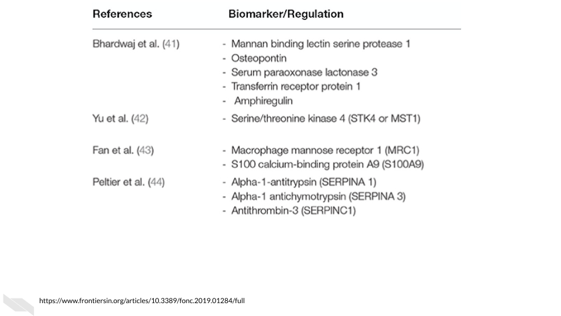

# Informatics project guidelines

## Identifying good informatics questions

Once you have identified your research team, your next step is to start thinking more deeply about the specific informatics questions you would like to evaluate. **Be sure to include team members of each discipline in these discussions.**

There are many important considerations to keep in mind when asking an informatics question: 

We suggest the following steps to take a great scientific question and make into a great informatically testable question.

### Steps for forming questions

1) Start with what you know and determine what is unknown
2) Clarify what is most important to learn about what is unknown. What key information would lead to more understanding? What would be most helpful to know to lead to a new treatment or prevention strategy? What would lead to more questions?
3) Narrow down what is unknown into specific statements based on what you identified as important to know from step 2.
4) Write the unknown statements into specific questions. (Look out for vague phrases!)
5) Make the questions into actionable tests by thinking about what would be measured or observed and ultimately what your variables would be in a statistical test.
6) Make a mock-up of what the data would look like. (Do you have necessary controls?)
7) Evaluate if that actionable test can be assessed with statistical methods and if you have access or can collect the necessary data. Rework as necessary, possibly returning to a different question from step 5. Think about possible biases or confounders.
8) Evaluate if the interpretation of the test would provide the insights that you are interested in.

For example, say we were interested in identify new diagnostic biomarkers for colorectal cancer. 
***Note:** this is only an illustrative example.*

These suggestions are based on that of: @wang_collaborating_2019. 

### STEP 1 - Identify what is known and unknown

First we would begin by identifying what is known and unknown:

Several potential blood-based biomarkers for colorectal cancer have been identified, however many are lacking evidence due to the previous studies having small sample sizes. 

[[source](https://www.frontiersin.org/articles/10.3389/fonc.2019.01284/full)]

You might ask how useful are these biomarkers for diagnosing colorectal cancer? 

So now we think about what is unknown:

You know the sizes of the previous samples that have assessed these biomarkers and you know the level of sensitivity reported by previous reports. However (assuming just this knowledge for illustration purposes), it is unknown:
 - How sensitive and specific some of these biomarkers are with sufficient sample sizes.
 - How collectively these biomarkers help to identify patients with cancer.
 - Which biomarkers are more important. 
 - Which biomarkers or combinations are particularly useful for determining disease progression or what treatment options might be best.  

### STEP 2 - Prioritize unknowns

Step 2 then involves determining which unknowns are the most important to you. This could be what is more translatable to aiding better diagnostics in a noninvasive way. This could be to better understand cancer progression and what these biomarkers tell us about patient prognosis. Determine what unknowns best fit your interest/expertise. Let's say that we want to know what is most translatable to aiding diagnostic tests now. 

### STEP 3 - Write specific statements

Step 3 then involves writing out specific statements for what is unknown related to making these biomarkers more useful for tests now. 

- It is unknown how useful many of these biomarkers are individually for the diagnosis of colorectal cancer in larger samples. 
- We do not know if combining these biomarkers together is useful in the diagnosis of colorectal cancer. 
- Perhaps combining these blood-based screens with other screens is useful. 

You can probably imagine many more statements, but we will keep this example simple.

### STEP 4 - Transform into specific questions

Step 4 involves transforming these into questions:

- At what sensitivity rate do each of these biomarkers aid in the diagnosis of colorectal cancer? 
- Does the use of a combination of these biomarkers for the diagnosis of colorectal cancer increase diagnosis rates better than any single biomarker?
- Does the use of a combination of any of these biomarkers with other non-blood-based screens improve diagnosis rates compared to either diagnostic method alone?

Look for terms or phrases that are vague in your questions and make them more specific. For example, "How helpful", "Is it better". Think about in what way something might be helpful or in what way something might be better. 

For simplicity purposes we will stick with only the second question.

### STEP 5 - Transform into actionable tests

Step 5 is to transform questions into actionable tests. For a question to be testable it must meet several requirements. We need to have variables that can be measured or observed. We need to have a variable we can modify or control, and we need to figure out what we cannot control. 

Now what are our variables, what can we control or observe? We will be observing diagnostic rates of colorectal cancer and biomarker expression, and we can modify or control how many biomarkers we choose to focus on to compare samples. 

This leads to many questions: 

Should we compare one biomarker vs all of the biomarkers?
Which single biomarker will we choose to compare to or will we look at all of them? 
Do we have the sample sizes to allow for the statistical power for so many tests? 
How will we look at the combination of biomarkers? A total score? 
Will it be additive or something more complicated? For example, we could prioritize some biomarkers over others. 

These are good questions to ask an informatics expert about. However we are getting to a more testable question. Now let's really think about what the data we would need and what it would look like.

Which brings us to step 6 where we create a mock-up of the data.

### STEP 6 - Create a mock-up of your data

Creating a mock-up of the data can make you ask yourself more questions about what you are asking and what you need to ask that question.
Would it be that we have blood results for these biomarkers for patients where we know (based on surgical pathology) if they have cancer?

What would these blood results look like? 
Would it be absolute expression levels of mRNA or protein? 
Do we have a threshold of elevated expression that we can use? 
Will we assign samples as yes or no in terms of meeting this threshold or will we use an absolute quantity or relative percentage over this threshold? 

Actually creating a mock-up of what the data might look like can reveal other important aspects that you may not yet have thought about. Thus here is the result of step 6.

### STEP 7 - Think about statistical tests

Step 7 is then to think about what statistical tests you might perform. Could we use a t-test to compare the scores among the patient groups? Would we want to account for other factors like the patients age or gender? Would another test be better? 

### STEP 8 - Think about interpretation

Step 8 is then to think about what this would mean. What would it mean if our results showed a difference in score between the groups? What can we interpret? Do we want to be able to predict patient status? This may involve moving back a step or two. 

Remember that working with your research teammates can help you to come up with a better research plan before you start collecting data. By involving experts from different domains you can make the most out of your research efforts. 

We would also suggest that you work with your informatics experts to come up with a biological research question (or set of questions) and a more technical question (or again set of questions) for each project. This can be a good strategy to ensure that everyone in your team gets authorship and that your team is as productive as possible.

For this example, your informatics employees or students might write a paper using simulated data or publicly available data to look at methods for creating biomarkers scores. Their studies could better inform you about how to think about testing the utility of colorectal biomarkers for diagnosis purposes.

## Informatics project pitfalls

One common misconception is that informatics research projects work out more often or are faster than wet bench experimental research projects. This is however not necessarily true and informatics projects are just as likely to fail and often take more time than one might expect. However, one advantage of having an informatics team member on a project is that there is ample free data available to add to or shift or reframe a study if necessary. This is important to keep in mind when advising your mentees and guiding the planning of their projects.

Common reasons why an informatics project might fail:  

1) **The goals were too vague** (see the previous section about identifying good informatics questions).  
Sadly this happens quite often and it can easily lead informatics employees and mentees down the wrong path.

2) **The data is not of high enough quality or lacks consistency**.  
This may be due to a faulty method, methodological differences between lab personnel, expired reagents, temperature differences on data collection days, or aging of a machine over time etc. Some of these issues can be avoided or reduced, while others are unavoidable. Do not be quick to blame your experimental research team members if the data does not look like you expect. Some variation in data is just a part of life. 

3) **There is not a strong enough signal in the data to detect the effect of interest with the current data/methods**.  
This is also a very common problem if you are not sure what the strength of the effect you are looking for might be (which is often the case in Biology). In this case you need more data or perhaps methods with greater granularity.

4) **The method of data collection becomes obsolete**.  
This may not make the project fail per se, but it can make publication difficult. Staying on top of what methods are currently being used can help to avoid this.

5) **The signal does not exist**.  
Sometimes our hypotheses are just wrong. 

## Informatics project pitfall mitigation methods

This section is in part based on a [book](https://www.manning.com/books/build-a-career-in-data-science) (@robinson_build_nodate) by Emily Robinson and Jacqueline Nolis.

We can mitigate some of these project weak points. (You may notice how some of these have been discussed previously.) However some of these are a bit unavoidable and it is best to have realistic expectations and flexibility about backup project ideas.

Ways to mitigate project failure:

1) **Discuss with experts**  
Discuss with trusted experts across all necessary domains about your informatics hypotheses to make sure they are feasible with the data you have or will generate before you get too far down the research path. Ask for their help to make sure that your scientific questions are not too vague. Do this as early as possible.

2) **Diversify projects**  
It is a good idea to diversify your mentees' and employees' projects to enable them to have exposure to different projects, as well as more opportunities to contribute to a project that will ultimately result in a product such as an academic paper or a new software package. 

3) **Safe project planning**  
Make sure mentees and employees have at least one very solid project. For example, assign a review article, a simple software package, or a project with very promising pilot data.

4) **Co-authorship**  
Allow lab members (especially mentees) to work together on projects. Assign one mentee or employee as the main personnel, but allow other team members to contribute in small ways to allow them to at least get co-authorship, just in case their main projects fail. 

5) **Plan for ample time**  
Plan for projects to have adequate time to account for setbacks. For example, if possible plan on the possibility that additional data may need to be collected or perhaps more data will need to be added from a data resource. It will take additional time to analyze the new data. Unfortunately, **simply plugging in new data to an existing script hardly ever works**.

 Instead the following tasks are required:  
 
* Check the quality of the new data  
* Reformat/wrangle the new data to match that of the existing data  
* Evaluate how different the new data is from the old data - are they similar enough to be included in a larger analysis or does this require two analyses?  
* Perform the analysis on the new data  

6) **Adjust and reframe**  
When a project appears to fail because the data turns out to not be adequate for answering your original question, reframe the project to answer a question that the data actually can answer.  

For example, if the goal of a project was to look for differential gene expression of a single gene and no significant difference is found, consider evaluating the gene expression of a pathway or network of genes that are involved in the same biological process. It is best to be transparent about your scientific process in your publications. 

7) **Get new data**  
In the worst case that the data does not appear to work for your initial goal and reframing the question does not seem possible, look for new data. Now there are many data resources available online. 

We have curated a [list of cancer research related data](https://docs.google.com/spreadsheets/d/1gyVMGunwXMnMeVxEUauuTcz7xWMji4daCkFAWnhuF7o/edit?usp=sharing) with the help of the [National Cancer Institute (NCI) Informatics Technology for Cancer Research (ITCR)](https://itcr.cancer.gov/) faculty. 

These are also good resources for finding cancer related data:  
 - The [cBioPortal](https://www.cbioportal.org/)  
 - This [article](https://www.nature.com/scitable/topicpage/genomic-data-resources-challenges-and-promises-743721/)  

Keep in mind that using new data takes time.

Using an existing script on new data rarely works because data can be formatted differently and have other intrinsic differences. This must first be evaluated to know how to proceed.

The following steps are required:

Overall we will summarize our suggestions for avoiding project pitfalls.

## Conclusion

We hope that having an awareness for how informatics projects can fail and that keeping these mitigation strategies in mind when you are planning your projects will help you to be more successful with your informatics research endeavors!

In conclusion, here are some of the take-home messages:

1) Follow the outlined steps for forming good informatics questions.
2) Especially remember to make a mock-up of what your data might look like for a project.
3) Remember that there are several sources for project pitfalls some of which are unavoidable at times, however discussing your plan early with other experts, planning for extra time, and diversifying projects can help.
   
   
