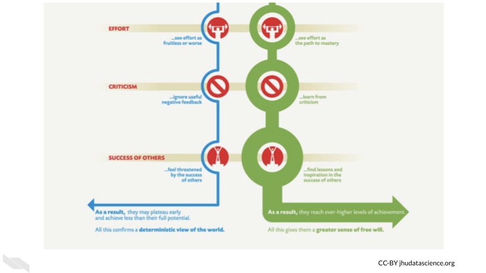

# Promoting Diversity

{alt: "Learning Objectives: 1) Know why diversity has been shown to be beneficial 2) Recognition about how certain groups are underrepresented in computational biology 3) Strategies to better support a more diverse team of employees, mentees, and collaborators", width: "100%", align: "middle"}

## Diversity is Beneficial

Beyond the critical importance of giving everyone more fair opportunities (which cannot be overstated), there are many additional crucial reasons why diversity is particularly important for science and health research.

The inclusion of diverse research team members promotes more inclusive research questions and practices to help the populations that need better health care the most.

> “Racial/ethnic minority groups in the United States are at disproportionate risk of being uninsured, lacking access to care, and experiencing worse health outcomes from preventable and treatable conditions.”(Jackson and Gracia 2014)

> “…Compared with the general population, racial/ethnic minority populations have poorer health outcomes from preventable and treatable diseases, such as cardiovascular disease, **cancer**, asthma, and human immunodeficiency virus/acquired immunodeficiency syndrome than those in the majority.”(Jackson and Gracia 2014)

> “… the social environment in which people live, learn, work, and play contributes to disparities and is among the most important determinants of health throughout the course of life.”(Jackson and Gracia 2014)

More diverse research teams may be more aware of the cultural differences and social determinants that may influence the health of the people that the research could serve. Such consideration could further increase the impact of the research.

The inclusion of diverse populations in scientific teams has also been shown to improve innovation (Hofstra et al. 2020).

> “Scholars from underrepresented groups have origins, concerns, and experiences that differ from groups traditionally represented, and their inclusion in academe diversifies scholarly perspectives. In fact, historically underrepresented groups often draw relations between ideas and concepts that have been traditionally missed or ignored.” (Hofstra et al. 2020)

## Underrepresentation in Cancer Informatics
 
However, analyses of scientific article authorship indicate that women are underrepresented in computational biology (Bonham and Stefan 2017) and biomedical engineering (Aguilar et al. 2019).

Furthermore, analyses of university faculty and students demonstrate that both women and historically marginalized populations (such as Black, Hispanic, and Native American) remain underrepresented in science, technology, engineering, and mathematics (STEM) fields in the US and in Europe (Hofstra et al. 2020; Chaudhary and Berhe 2020).

{alt: "Hilda, the happy informaticist thinks: My advisor Sally made the expectations for the lab clear when I joined. This has been helpful, because it made me realize some expectations that I wouldnt have assumed.", width: "100%", align: "middle"}

## Ways to better support a more diverse research team

In order to best support and encourage mentees and employees of underrepresented groups in cancer informatics, we suggest that lab leaders do the following: 

### Seek additional **training about disparities** in informatics and STEM careers

Especially focus on hindrances to achievement such as **attitudes**, **biases**, and **stereotypes**. Also, become aware of **stereotype threat** - “an internal feeling and concern about confirming a negative stereotype associated with a group (e.g., racial, ethnic, gender, and age) with which the individual identifies”(Stelter, Kupersmidt, and Stump 2021) and how they might influence your mentees.

Here is a great video of [Russell McClain](https://www.law.umaryland.edu/directory/profile.asp?id=492) at the University of Maryland that introduces how implicit bias and stereotype threat impact higher education:

{alt: "video of Russell McClain on biases and stereotypes", height: "315", width: "560", align: "middle"}

Note that you may not be aware of all the barriers of achievement that your mentees may face. For example, mentees from low socioeconomic backgrounds, mentees with disabilities, mentees who have immigrated, older mentees, mentees of traditionally underrepresented races and ethnic groups, and mentees with gender identities that are underrepresented face unique and sometimes overlapping challenges. It is also important to learn about how **intersectionality** (the idea that some individuals may represent more than one underrepresented group (ex. female and black)) results in more nuanced challenges. 

For example:

> When the intersection of race/ethnicity and gender is considered, women of color report even less access to mentorship and support from mentors than other groups. (Davis et al. 2021)

Here is a great video of [Kimberlé Crenshaw](https://en.wikipedia.org/wiki/Kimberl%C3%A9_Williams_Crenshaw) at UCLA and Columbia  describes the theory of intersectionality, which she developed:

{alt: "video about intersectionality", height: "315", width: "560", align: "middle", type: video, poster: "http://img.youtube.com/vi/VOCYL-FNbr0/mqdefault.jpg"}

{height: "800px", width: "672", align: "middle"}

Also, become aware of **microaggressions** - “subtle verbal and nonverbal slights, insults, or invalidating remarks directed at individuals due to their membership in a group (e.g., racial, ethnic, gender, sexual orientation, age, and physical disability), which are rooted in biases about individuals in that group”(Stelter, Kupersmidt, and Stump 2021).

See below a list of examples:

{height: "800px", width: "672", align: "middle"}

[[Source](https://www.messiah.edu/download/downloads/id/921/Microaggressions_in_the_Classroom.pdf)]

Importantly, “mentors for students with disabilities should receive training, as needed, on their mentee’s specific disability and should be made aware of the accommodations that students may need to succeed in activities and courses” (Stelter, Kupersmidt, and Stump 2021).

### **Acknowledge mentee's differences** 

Research shows that mentees of underrepresented racial groups would prefer their mentors to directly discuss their background differences and how to best cultivate the mentee’s career success given their background. An attitude of [“color-blindness”](https://doi.org/10.1016/j.jesp.2011.09.010) about race has shown to **hinder the success** of mentees (Byars-Winston et al., n.d.; Holoien and Shelton 2012).

Talk with your team members **individually** (be careful not to single out individual team members in front of the rest of the lab) about how they would like to discuss the potential influences on their career growth.

> “Racial/ethnic differences between mentees and mentors in interracial mentoring relationships can pose cultural barriers to effective mentoring of HU (Historically underrepresented) students and even affect students’ professional and psychosocial success, especially when complex racial/ethnic issues are not effectively handled or addressed…” (Byars-Winston et al., n.d.)

> “Two ideological perspectives – **colorblindness and multiculturalism** – have emerged to shed light on this question. Colorblindness downplays the salience and importance of race by focusing on the commonalities people share, such as one’s underlying humanity. In contrast, multiculturalism acknowledges and highlights racial differences (Holoien and Shelton 2012).”

> “Exposure to colorblind (vs. multicultural) messages predicts negative outcomes among Whites such as greater implicit and explicit racial bias ([Richeson & Nussbaum, 2004](https://www.sciencedirect.com/science/article/pii/S002210311100240X?via%3Dihub#bb0080))” (Holoien and Shelton 2012)

> “\[Underpresented groups\] benefit when others around them endorse multiculturalism ([Plaut et al., 2009](https://www.sciencedirect.com/science/article/pii/S002210311100240X?via%3Dihub#bb0070))”(Holoien and Shelton 2012)

### **Work to create a safe environment**   

Educate lab mentors about cultural sensitivity and microaggressions. Highlight the importance of collaboration and create a [code of conduct](https://i-sight.com/resources/18-of-the-best-code-of-conduct-examples/) for the lab to demonstrate that respect among lab members is expected and required.

### **Diverse role models** 

Expose all mentees to a diverse range of role models through seminars, journal clubs, and participation in conferences.

Computational biology papers with female authors are more likely to have a last author is also female. It is unclear if this is because women are more likely to hire other women and or if females are more likely to choose a lab with a female adviser (Bonham and Stefan 2017).

Indeed, research of females and other underrepresented groups in STEM including students with disabilities and of certain racial and ethnic groups suggests that role models of underrepresented populations are particularly important for recruiting and keeping students interested in fields where they may feel like an outsider (Stelter, Kupersmidt, and Stump 2021).

One strategy to encourage students of underrepresented populations is to provide students with exposure to such role models through regular seminars where scientists who represent these populations are prominent (Katz 2007).

### **Advocate for all mentees**

Introduce your mentee to other scientists and trainees particularly those from underrepresented groups.

Encouraging the participation of your mentees in support programs and groups such as graduate student groups.

Help mentees cultivate self advocacy practices through open discussions and encouragement.

### Support a **healthy relationship with failure** 

Be a good role model and openly discuss the role of failure in research. For example, you may describe failures in your own career or you may read some of the book [Brilliant Blunders](https://www.simonandschuster.com/books/Brilliant-Blunders/Mario-Livio/9781439192375) by [Mario Livio](https://en.wikipedia.org/wiki/Mario_Livio) or [this article](https://www.nytimes.com/2013/06/09/books/review/brilliant-blunders-by-mario-livio.html?.?mc=aud_dev&ad-keywords=auddevgate&gclid=CjwKCAjwtJ2FBhAuEiwAIKu19sjNSii_CXfcJ74pWoiPBbdu2v55oznTz4QAQi5zjb-l54-jb_DyyxoC16MQAvD_BwE&gclsrc=aw.ds) about the book with your mentees. This book describes how scientific advancement actually occurred due to mistakes of some of the most respected scientists. Educating mentees about the **[Growth Mindset](https://www.brainpickings.org/2014/01/29/carol-dweck-mindset/)** described by [Carol Dweck](https://en.wikipedia.org/wiki/Carol_Dweck) may also be helpful. The major themes of this mindset is an awareness that our abilities are not fixed, that we can change our aptitudes with practice and work. 

{alt: "Two Mindsets according to Carol S Dweck, Ph.D. and graphic by Nigel Holmes: Fixed Mindset in which intelligence is viewed as static. This leads to a desire to look smart and therefore a tendency to avoid challenges, give up easily, see effort as fruitless or worse, ignore useful negative feedback, and feel threatened by the success of others. As a result, those with the this mindset may plateau early and achieve less than their full potential. All this confirms a deterministic view of the world. The other mindset is the Growth Mindset in which intelligence is viewed as something that can be developed. This leads to a desire to learn and therfore a tendency to: embrace challenges, persist in the face of setbacks, see effort as the path to mastery, learn from criticism, and find lessons and inspiration in the success of others. As a result, those with this mindset reach ever-higher levels of achievement. All this gives them a greater sense of free will.", width: "100%", align: "middle"}

{alt: "Two Mindsets according to Carol S Dweck, Ph.D. and graphic by Nigel Holmes: Fixed Mindset in which intelligence is viewed as static. This leads to a desire to look smart and therefore a tendency to avoid challenges, give up easily, see effort as fruitless or worse, ignore useful negative feedback, and feel threatened by the success of others. As a result, those with the this mindset may plateau early and achieve less than their full potential. All this confirms a deterministic view of the world. The other mindset is the Growth Mindset in which intelligence is viewed as something that can be developed. This leads to a desire to learn and therfore a tendency to: embrace challenges, persist in the face of setbacks, see effort as the path to mastery, learn from criticism, and find lessons and inspiration in the success of others. As a result, those with this mindset reach ever-higher levels of achievement. All this gives them a greater sense of free will.", width: "100%", align: "middle"}

[[source](https://www.brainpickings.org/2014/01/29/carol-dweck-mindset/)]

### **Celebration and microaffirmations**   

Be sure to celebrate **all** of your mentees’ small and large successes. This has been shown to promote confidence and resilience (Stelter, Kupersmidt, and Stump 2021).

Be generous complementing or pointing out small success in discussions with your mentees and thank your mentees for performing tasks that they may assist you or your lab.

For larger successes, consider sharing a meal or other social activity with your lab. For virtual or remote lab members this could be playing a game online.

Again aim to do this with all your mentees/lab members. Be mindful about not singling out particular mentees. This could further make such lab members feel like they don't belong.

### **Give feedback with cultural sensitivity**  

It is important to be aware that your mentee may be struggling with feeling like they don’t belong when you provide feedback (Stelter, Kupersmidt, and Stump 2021; Lee, Dennis, and Campbell 2007). Thus, when given criticism, certain mentees who may especially feel like they don’t belong because of their background differences, may feel very discouraged. Try to still be encouraging when delivering criticism by acknowledging what is going well and what is progressing.

This [article](https://online.alvernia.edu/articles/constructive-criticism-in-the-workplace/) has several good tips for delivering criticism that we will summarize here with our own thoughts:

1) Allow for a discussion about what went wrong.  

You may learn that your mentee struggled for an entirely different reason than you expected. Having a discussion allows you to better determine how your mentee might be able to perform better in the future.

2) Give criticism in a sandwich.  

Say something positive, deliver the criticism, then say something else positive.

3) Focus on the actions instead of personality traits. Think about how they can improve.

For example, instead of saying "You seem to have time management issues", you could say something like, "Navigating and prioritizing all these projects is a difficult task and I think we can do better as a team."

4) Be specific and suggest improvements.

You want your mentees to know exactly what they should be aiming to improve and why. Vague criticism may reduce their confidence and will not help them improve as much as concrete specific suggestions and discussion.

5) Deliver criticism in private.

Especially if your mentee is feeling like they don't belong, criticism in front of other lab members can really impact their confidence. It can also lead to more unhealthy competitive dynamics between lab members.

6) Don't surprise your mentees with criticism.

Build criticism into regular meetings with your mentee. Don't create a meeting out of the blue to tell them they need to improve as this may cause excess stress. Secondly, criticism can be normalized if it is delivered gently and in the ways we just outlined. 

### Consider creating a document of **mentor and mentee expectations**.

These documents help clarify what mentees can expect. This allows is helpful for your mentees to better perform according to expectations, as they are explicitly stated rather than intuited.

{alt: "expectation document", height: "351", width: "568", align: "middle"}

[[source](https://journals.plos.org/ploscompbiol/article?id=10.1371/journal.pcbi.1005709)]

Masters and Kreeger (2017) has created a nice set of [guidelines](https://journals.plos.org/ploscompbiol/article?id=10.1371/journal.pcbi.1005709) for such documents.

Also see [here](https://ictr.wisc.edu/mentoring/) for more information about such documents. Keep in mind that such forms should be tailored for different career stages of your mentees and for mentees who are pursuing different expertise. Informatics mentees should incorporate guidelines about data management practices. We will discuss a bit more about that in the next chapter. 

## References
Jackson, Chazeman S., and J. Nadine Gracia. 2014. “Addressing Health and Health-Care Disparities: The Role of a Diverse Workforce and the Social Determinants of Health.” *Public Health Reports* 129 (Suppl 2): 57–61. <https://www.ncbi.nlm.nih.gov/pmc/articles/PMC3863703/>.

Hofstra, Bas, Vivek V. Kulkarni, Sebastian Munoz-Najar Galvez, Bryan He, Dan Jurafsky, and Daniel A. McFarland. 2020. “The Diversity–Innovation Paradox in Science.” *Proceedings of the National Academy of Sciences* 117 (17): 9284–91. <https://doi.org/10.1073/pnas.1915378117>.

Aguilar, Izath Nizeet, Venkateswaran Ganesh, Rachel Mannfeld, Riley Gorden, Jennifer M. Hatch, Shatoria Lunsford, Elizabeth C. Whipple, Randall T. Loder, and Melissa A. Kacena. 2019. “Authorship Trends Over the Past 30-Years in the Annals of Biomedical Engineering.” *Annals of Biomedical Engineering* 47 (5): 1171–80. <https://doi.org/10.1007/s10439-019-02222-3>.

Bonham, Kevin S., and Melanie I. Stefan. 2017. “Women Are Underrepresented in Computational Biology: An Analysis of the Scholarly Literature in Biology, Computer Science and Computational Biology.” *PLOS Computational Biology* 13 (10): e1005134. <https://doi.org/10.1371/journal.pcbi.1005134>.

Chaudhary, V. Bala, and Asmeret Asefaw Berhe. 2020. “Ten Simple Rules for Building an Antiracist Lab.” *PLOS Computational Biology* 16 (10): e1008210. <https://doi.org/10.1371/journal.pcbi.1008210>.

Stelter, Rebecca L., Janis B. Kupersmidt, and Kathryn N. Stump. 2021. “Establishing Effective STEM Mentoring Relationships Through Mentor Training.” *Annals of the New York Academy of Sciences* 1483 (1): 224–43. <https://doi.org/10.1111/nyas.14470>.

Davis, Tangier M., Martinque K. Jones, Isis H. Settles, and Paulette Granberry Russell. 2021. “Barriers to the Successful Mentoring of Faculty of Color.” *Journal of Career Development*, May, 089484532110133. <https://doi.org/10.1177/08948453211013375>.

Byars-Winston, Angela, Patrice Leverett, Ross J Benbow, Christine Pfund, Nancy Thayer-Hart, and Janet Branchaw. n.d. “Race and Ethnicity in Biology Research Mentoring Relationships,” 14.

Holoien, Deborah Son, and J. Nicole Shelton. 2012. “You Deplete Me: The Cognitive Costs of Colorblindness on Ethnic Minorities.” *Journal of Experimental Social Psychology* 48 (2): 562–65. <https://doi.org/10.1016/j.jesp.2011.09.010>.

Katz, Samantha. 2007. “Mentoring Women in the Biological Sciences: Is Informatics Leading the Pack?” *BioScience* 57 (7): 559–59. <https://doi.org/10.1641/B570705>.

Lee, Adrian, Carina Dennis, and Philip Campbell. 2007. “Nature’s Guide for Mentors.” *Nature* 447 (7146): 791–97. <https://doi.org/10.1038/447791a>.

Masters, Kristyn S., and Pamela K. Kreeger. 2017. “Ten Simple Rules for Developing a Mentor–Mentee Expectations Document.” Edited by Fran Lewitter. *PLOS Computational Biology* 13 (9): e1005709. <https://doi.org/10.1371/journal.pcbi.1005709>.

